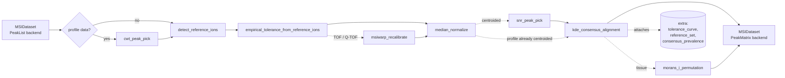

# DAPPLE algorithmic reference

What each operator computes, the equations, the parameters, and the rationale
behind every default. If you want to know how to use the tool, read the
[user guide](userguide.md) first.

DAPPLE's design posture: prefer empirical CDFs over parametric multiples of σ,
prefer permutation nulls over parametric ones, prefer bounded conservative
defaults over ones that optimize annotation count. Everywhere a default is
committed, this document explains why — and what would push you up or down.

---

## Contents

1. [Pipeline overview](#pipeline-overview)
2. [Recommended pipeline](#recommended-pipeline) — the default chain produced by `recommend_pipeline(ep)`
3. [Operator: detect_reference_ions](#operator-detect_reference_ions)
4. [Operator: empirical_tolerance_from_reference_ions](#operator-empirical_tolerance_from_reference_ions)
5. [Operator: msiwarp_recalibrate](#operator-msiwarp_recalibrate)
6. [Operator: lock_mass_recalibrate](#operator-lock_mass_recalibrate)
7. [Operator: median_normalize / tic_normalize / reference_ion_normalize](#operator-median_normalize--tic_normalize--reference_ion_normalize)
8. [Operator: snr_peak_pick](#operator-snr_peak_pick)
9. [Operator: cwt_peak_pick](#operator-cwt_peak_pick)
10. [Operator: kde_consensus_alignment](#operator-kde_consensus_alignment)
11. [Operator: dbscan_consensus](#operator-dbscan_consensus)
12. [Operator: prevalence_fdr_filter](#operator-prevalence_fdr_filter)
13. [Operator: morans_i_permutation](#operator-morans_i_permutation)
14. [Operator: hot_pixel_filter](#operator-hot_pixel_filter)
15. [Operator: background_subtract](#operator-background_subtract)
16. [Cohort harmonization](#cohort-harmonization)
17. [ROI enrichment analysis](#roi-enrichment-analysis)
18. [Directed developmental-axis analysis](#directed-developmental-axis-analysis)
19. [Analysis export](#analysis-export)
20. [Per-pixel projections](#per-pixel-projections)
21. [Pipeline runner: caching, hashing, RNG](#pipeline-runner-caching-hashing-rng)
22. [Diagnostic rubric & health checks](#diagnostic-rubric--health-checks)
23. [Reproducibility manifest (`.spec.xml`)](#reproducibility-manifest-specxml)
24. [Harmonized imzML round-trip](#harmonized-imzml-round-trip)
25. [Current computational limits](#current-computational-limits)
26. [Command-line workflows](#command-line-workflows)

---

## Pipeline overview

A DAPPLE `Pipeline` is a topologically sorted directed acyclic graph (DAG) of
`Node` records. Each `Node` names an operator (registry key), an
immutable `OpParams` dataclass, and an `upstream` list of node ids. Operators
read an `MSIDataset`, optionally read upstream extras (e.g. a `ReferenceSet`
attached by `detect_reference_ions`), and return:

- a new `MSIDataset` (with updated `backend`, possibly different
  `extra` payload, an appended `OpRecord` in `history`)
- a list of `Diagnostic`s (a scalar `summary` dict, an optional `payload` of
  numpy arrays for the threshold-explorer / what-if reasoning, and an optional
  `figure_hint`)



Operators are deterministic given the same input, parameters, derived node RNG,
and library versions.
The `PipelineRunner` exploits that to short-circuit unchanged nodes via a
content-addressed cache. See
[Pipeline runner](#pipeline-runner-caching-hashing-rng).

---

## Recommended pipeline

`recommend_pipeline(ep: ExperimentParams)` produces one of two orders:

| Data mode | Default order |
| :-------- | :------------ |
| Profile | `cwt_peak_pick` → `detect_reference_ions` → empirical tolerance → optional TOF/Q-TOF recalibration → median normalization → KDE consensus → optional tissue spatial filter |
| Centroided | `detect_reference_ions` → empirical tolerance → optional TOF/Q-TOF recalibration → median normalization → `snr_peak_pick` → KDE consensus → optional tissue spatial filter |

The profile order is scientifically important. Dense profile samples are not
independent peaks: sending them directly to reference detection makes adjacent
bins look universally prevalent and can collapse them into false reference
features. CWT therefore converts each trace to centroids first. It is not run a
second time after normalization.

`hot_pixel_filter`, `prevalence_fdr_filter`, and `background_subtract` are
visible opt-in cards in the wizard and remain disabled by default. The Moran's I
filter is included only for `sample_type == "tissue"`, where spatial coherence
is a meaningful expectation.

---

## Operator: `detect_reference_ions`

Module: [`ops/reference_ions.py`](../src/dapple/ops/reference_ions.py)

### Purpose

Identify a small set of m/z values present in many pixels — *reference ions*.
These anchor the empirical tolerance fit and any later recalibration.
Concretely we want anywhere from 5 to a few dozen endogenous peaks (matrix
peaks, common contaminants, internal standards) that recur across the image
with high prevalence.

### Algorithm

Input: a `PeakList`-backed `MSIDataset` with `n_pixels` pixels and a flat
peak list `(mz_data, intensity_data, offsets)`.

1. **Log-space binning.** Define a coarse bin width
   `step = ln(1 + ppm * 1e-6)` where `ppm = coarse_tol_ppm`. Each peak's bin
   index is `floor(log(mz) / step) - bin0`. Log-spacing means a constant ppm
   bin width across the m/z range.

2. **Best peak per (pixel, bin).** Stable-sort all peaks by
   `(pixel, bin, -intensity)` and keep only the first row of each
   `(pixel, bin)` group. This dedups the case where one pixel has multiple
   peaks within `coarse_tol_ppm` of each other — the brightest survives.

3. **Per-bin prevalence.** Count, per bin, how many distinct pixels contributed
   a peak: `bin_count[c] = Σ_pixels 1{any peak in bin c}`. Convert to a
   fraction: `prevalence[c] = bin_count[c] / n_pixels`.

4. **Filter.** Keep bins with `prevalence ≥ min_prevalence` AND
   `bin_count ≥ min_count`.

5. **Merge adjacent bins.** Adjacent kept bins (`merge_adjacent_bins=True`,
   default) are coalesced into one reference ion — handles peaks that straddle
   a bin edge.

6. **Centroid.** For each merged group, the reference m/z is the
   intensity-weighted mean of every contributing peak across every contributing
   pixel:

   $$m/z_\text{ref} = \frac{\sum_{(pixel, peak)} m/z \cdot I}{\sum_{(pixel, peak)} I}$$

7. **Per-pixel ppm error.** For each `(pixel, reference)` pair we compute the
   ppm offset of the pixel's observed m/z (the brightest peak in the merged
   group) from the reference centroid:

   $$\Delta_\text{ppm} = \frac{m/z_\text{observed} - m/z_\text{ref}}{m/z_\text{ref}} \times 10^6$$

   These errors are the empirical foundation of the next operator.

### Output

A `ReferenceSet` is attached to `ds.extra["reference_set"]` with:

- `mz` — sorted reference centroids `(R,) float64`
- `prevalence` — `(R,) float64` in [0, 1]
- `n_observations` — `(R,) int64`, pixel counts
- `per_pixel_mz` — `(n_pixels, R) float64`, NaN where missing
- `per_pixel_intensity` — `(n_pixels, R) float32`, 0 where missing
- `per_pixel_ppm_error` — `(n_pixels, R) float64`, NaN where missing

### Parameters

| Field | Default | Adjustment guidance |
| :---- | :------ | :------------------ |
| `coarse_tol_ppm` | family-aware: 5 (Orbitrap/FT-ICR), 50 (Q-TOF / reflectron TOF), 200 (axial linear MALDI-TOF) | Wider catches more candidates but may merge unrelated peaks. Match to the worst-case ppm error you expect in unrecalibrated data. |
| `min_prevalence` | 0.8 (centroided) / 0.7 (profile) | The fraction of pixels required to call a peak a reference. Lower (0.5) for sparse images; raise (0.95) to be very selective. |
| `min_count` | 5 | Hard floor on supporting pixels. Survey's recommended minimum. |
| `merge_adjacent_bins` | `True` | Disable only when peaks are very dense and you expect them to remain distinguishable at `coarse_tol_ppm`. |

### Diagnostic

`summary`: `n_reference_ions`, prevalence min/median/max,
`coarse_tol_ppm`, `min_prevalence`. `payload`: `reference_mz`,
`prevalence`, `n_observations` arrays.

### Notes on defaults

A minimum of 5 reference ions (`min_count=5`) is the floor below which the
empirical-tolerance bootstrap CIs become unstable. 20 or more is comfortable
for most centroided MALDI-TOF or DESI datasets.

---

## Operator: `empirical_tolerance_from_reference_ions`

Module: [`ops/tolerance.py`](../src/dapple/ops/tolerance.py)

### Purpose

Estimate the per-m/z tolerance — how wide a window around each m/z we need to
include the same analyte across pixels — directly from the data, without
committing to a parametric scaling law (TOF: `1/√m/z`, Orbitrap: `√m/z`, etc.).

### Algorithm

1. Pull per-pixel ppm errors from
   `ds.extra["reference_set"].per_pixel_ppm_error`. Stack into pairs
   `(m/z_centroid, |ppm_error|)`, dropping NaN entries.

2. **Quantile binning.** Sort pairs by m/z and partition into ≤30 quantile
   bins (so each bin has roughly the same number of observations).

3. **Empirical (1 − α/2)-quantile per bin.** For α = 0.01, this is the 99.5th
   percentile of `|ppm_error|` within the bin. Distribution-free — no
   Gaussian assumption.

4. **Pool-Adjacent-Violators (PAV).** Enforce monotone non-decreasing across
   bins by walking left-to-right, pooling any pair that violates monotonicity
   into a weighted average of its members. The result is the smallest function
   that is monotone non-decreasing and has the same average as the input
   within each pooled segment.

5. **Linear interpolation onto a 200-point grid** spanning the observed m/z
   range.

6. **Bootstrap CI.** Repeat steps 1–5 on `bootstrap_B` bootstrap resamples
   of the pixels. By default we use **block bootstrap** (resample whole
   spatial blocks of size `block_size_pixels = 32` rather than independent
   pixels) so the CI respects spatial autocorrelation. The 2.5th and 97.5th
   percentiles across replicates give the CI envelope.

If fewer than 5 valid `(m/z, |ppm|)` pairs are available, the operator falls
back to a flat tolerance equal to the (1 − α/2)-quantile of all available
errors and emits a `warning_flat_tolerance=1.0` summary key.

### Output

A `ToleranceCurve` attached to `ds.extra["tolerance_curve"]`:

- `mz_grid` — `(200,) float64`, ascending
- `ppm_quantile` — `(200,) float64`, the working tolerance
- `ci_low`, `ci_high` — `(200,) float64`, bootstrap 95% CI band
- `evaluate(mz)` — interpolates onto arbitrary m/z queries; consensus alignment
  and recalibration operators call this.

### Parameters

| Field | Default | Adjustment guidance |
| :---- | :------ | :------------------ |
| `alpha` | 0.01 | Sets coverage; α = 0.01 → 99% coverage. Smaller α → wider tolerance. |
| `bootstrap_B` | 1000 | Drop to 200–500 for speed during iteration; raise to 5000 for very tight CIs. |
| `block_bootstrap` | `True` | Disable only if pixels are demonstrably independent. |
| `block_size_pixels` | 32 | Roughly the spatial scale of your tissue features. Too small under-corrects; too large collapses effective sample size. |

### Notes

The pool-adjacent-violators monotonization is a shape constraint borrowed from
isotonic regression; it ensures tolerance is non-decreasing in m/z without
committing to any particular instrument-physics scaling law (TOF: `1/√m/z`,
Orbitrap: `√m/z`, FT-ICR: `1/m`). The empirical curve will follow whichever
regime actually dominates the user's instrument.

---

## Operator: `msiwarp_recalibrate`

Module: [`ops/recalibrate.py`](../src/dapple/ops/recalibrate.py)

### Purpose

Per-pixel mass-axis correction. Mass drift across an MSI acquisition (thermal,
space-charge, AGC, topography) is the largest single residual in unrecalibrated
TOF / Q-TOF data and can reach tens to hundreds of ppm even on instruments that
were locked at the start of the run. This operator fits a per-pixel piecewise-
linear warp from each pixel's *observed* reference m/z values to the
ReferenceSet's *consensus* centroids, with RANSAC-based outlier rejection so a
single mis-identified anchor doesn't drag the warp.

Recalibration is inserted by `recommend_pipeline` for the TOF families
(`tof_axial`, `tof_reflectron`, `qtof`) where mass drift dominates. Orbitrap and
FT-ICR are locked enough that recalibration adds noise more often than it helps;
the operator's `validate(ep)` warns when called on those families.

### Algorithm

For each pixel:

1. Gather visible `(m/z_observed, m/z_reference)` pairs from
   `ds.extra["reference_set"]`.
2. **RANSAC** over `ransac_n_trials` random size-2 subsets. For each subset,
   fit a linear warp `m/z → m/z'` and count inliers (other anchor pairs whose
   `|ppm residual|` falls below the per-anchor threshold). The anchor threshold
   is taken from the upstream tolerance curve at each anchor's m/z (`2 ×
   ppm_quantile(m/z_ref)` by default), or a user-supplied constant. The trial
   with the most inliers wins; ties broken by smallest residual sum.
3. **Piecewise-linear warp** through the inlier set: sort by m/z_observed,
   build a linear interpolant `f(m/z) = numpy.interp(...)`. Outside the anchor
   range, extrapolate by translation only — the boundary anchor's offset is
   added without scaling, so we don't extrapolate the slope past the data.
4. Apply `f` to every peak m/z in the pixel.

Pixels with fewer than `min_inliers` surviving anchors are left untouched (the
diagnostic records them) — recalibrating from a 2-point linear fit is too
unstable to risk.

### Parameters

| Field | Default | Adjustment guidance |
| :---- | :------ | :------------------ |
| `ransac_threshold_ppm` | 0 (use 2× tolerance curve) | Set explicitly to harden or relax outlier rejection. Smaller = stricter; larger = more anchors retained but noisier fit. |
| `ransac_n_trials` | 64 | With ≥ 5 anchors per pixel this finds a good seed essentially every time; raise only when you have many anchors with heavy contamination. |
| `min_inliers` | 3 | Skip recalibration for any pixel with fewer surviving anchors. Two-point linear fits are unreliable. |

### Diagnostic

- `summary` keys: `n_pixels_recalibrated`, `n_pixels_skipped`,
  `fraction_pixels_recalibrated`, `inliers_median`,
  `pre_residual_median_ppm`, `post_residual_median_ppm`, `improvement_ppm`.
- `payload` arrays: `per_pixel_inliers`, `per_pixel_used`,
  `pre_ppm_residual` and `post_ppm_residual` (full
  `(n_pixels × n_reference_ions)` matrices) so you can compare the residual
  distributions directly.

### Notes

The MSIWarp paper (Eriksson et al., 2020) introduced this approach with
piecewise-linear warps and reported 3–10× residual reduction on TOF-MSI. Our
implementation differs in two places: we use straight RANSAC inlier selection
(simpler than the paper's iterative regularized fit) and we extrapolate by
translation rather than slope past the anchor range (slightly more conservative).

---

## Operator: `lock_mass_recalibrate`

Module: [`ops/recalibrate.py`](../src/dapple/ops/recalibrate.py)

### Purpose

Single-anchor per-pixel m/z shift. Where ``msiwarp_recalibrate`` fits a linear
warp from several reference anchors per pixel, ``lock_mass_recalibrate`` picks
*one* anchor per pixel and shifts every peak in the pixel by the matching
ppm offset.

This is the right choice when:

- Only one reference ion is reliable across the image (a known matrix peak you
  trust, or a deliberately spiked internal standard).
- The dataset has too few anchors per pixel for ``msiwarp``'s linear fit to be
  stable (< 3 visible anchors typical).
- You want a simpler, lower-variance correction than RANSAC + linear fit.

### Algorithm

For each pixel:

1. **Select an anchor** according to ``anchor_strategy``:
   - ``highest_intensity`` (default) — the reference ion with the strongest
     observed signal in this pixel. The most defensible default since
     low-intensity anchors carry larger m/z uncertainty.
   - ``highest_prevalence`` — the globally most-prevalent reference (stable
     across pixels but may be dim in some).
   - ``closest_to_mz`` — whichever reference centroid is nearest
     ``explicit_anchor_mz``. Use when you know the m/z of a stable lock-mass
     molecule.
2. **Compute a multiplicative shift factor** `s = m/z_observed / m/z_reference`.
3. **Refuse the correction** if `|ppm shift| > max_shift_ppm` (default 500).
   This is the operator's defense against single misidentified anchors that
   would otherwise blow up the pixel. Refused pixels are left untouched.
4. **Apply** to every peak: `m/z_new = m/z_old / s`.

The diagnostic records per-pixel `ppm_shift`, the chosen anchor index per
pixel, and an `applied_mask` so you can see exactly which pixels were corrected.

### Parameters

| Field | Default | Adjustment guidance |
| :---- | :------ | :------------------ |
| `anchor_strategy` | `"highest_intensity"` | Switch to ``"closest_to_mz"`` when you have a known stable lock-mass molecule. |
| `explicit_anchor_mz` | 0 (unset) | Required for ``closest_to_mz``. |
| `max_shift_ppm` | 500 | Refuse to apply shifts larger than this. Tighten for high-resolution instruments. |

### Notes

This operator is rarely better than ``msiwarp_recalibrate`` when both apply.
Its main use case is sparse-anchor data and the case where a single
hand-picked lock-mass is all you trust.

---

## Operator: `median_normalize` / `tic_normalize` / `reference_ion_normalize`

Module: [`ops/normalize.py`](../src/dapple/ops/normalize.py)

### Purpose

Make per-pixel intensities comparable across the image by dividing each pixel
by a per-pixel scale factor.

### Algorithm

For each pixel `i` with intensities `I_i = (I_{i,0}, ..., I_{i,n_i-1})`:

- **median**: `f_i = median{ I_{i,j} : I_{i,j} > 0 }` (default).
- **tic**: `f_i = Σ_j I_{i,j}`.

Both fall through to `eps = 1e-12` when the pixel is empty. The pixel's
intensities are replaced with `I_{i,j} / f_i`. m/z values are unchanged.

### Why median is the default

TIC normalization assumes ionization efficiency is roughly constant across
pixels. Real MSI data violates this regularly:

- A saturating analyte in part of the image inflates that region's TIC.
- Matrix-effect heterogeneity (DESI droplet trails, MALDI matrix-crystal
  patches) creates spatial variation in the dominant peak's intensity.
- Vendor exports sometimes pre-normalize TIC at write time; running TIC again
  on already-pre-normalized data is a no-op masquerading as normalization.

The per-pixel non-zero median is robust to a single dominant peak: scaling 5
real peaks by `median(top, mid, mid, mid, low)` is much less skewed by the
"top" than scaling by their sum is.

### Parameters

| Field | Default | Adjustment guidance |
| :---- | :------ | :------------------ |
| `method` | `"median"` | `"tic"` is available but flagged in `validate()`; use only if you have a good reason. |
| `eps` | 1e-12 | Avoids divide-by-zero on empty pixels. Don't change. |

### Diagnostic

Per-pixel factor distribution: `factor_min`, `factor_q25`, `factor_median`,
`factor_q75`, `factor_max`, plus the full `per_pixel_factor` array as
payload.

### `reference_ion_normalize`

A third normalization variant. Per-pixel scale factor is the **sum of
intensities at the reference ions** that ``detect_reference_ions`` picked
upstream:

  `f_i = max( Σ_r I_{i, r}, eps )`

with the sum taken over reference ions `r ∈ ReferenceSet`. It's a defensible
alternative to median when matrix peaks (or other endogenous standards) are
stable across the image: their summed intensity is a per-pixel readout of
ionization efficiency that doesn't depend on analyte abundance the way TIC does.

Caveat surfaced by `validate(ep)`: on heterogeneous tissue with locally variable
matrix coverage the reference-ion sum itself varies with the matrix-covered
fraction of the pixel, which can over-correct. Median is still the safer default
in those cases.

### Notes

The methodology literature on MSI normalization is consistent on this point:
TIC fails on most non-trivial samples; per-pixel median (or per-pixel
reference-ion sum, when available) is the appropriate default for tissue
imaging.

---

## Operator: `snr_peak_pick`

Module: [`ops/peak_pick.py`](../src/dapple/ops/peak_pick.py)

### Purpose

Filter centroided peak lists to those above a per-pixel noise floor. Already-
centroided data has been peak-picked once by the vendor; this operator drops
spurious low-intensity peaks that snuck through.

### Algorithm

For each pixel `i`:

1. Compute the **median absolute deviation** of intensities:
   `MAD_i = median(|I_i - median(I_i)|)`.
2. Convert to a robust σ estimate: `σ_i = 1.4826 · MAD_i`. The 1.4826 factor
   makes MAD a consistent σ estimator under Gaussianity, but we don't actually
   require Gaussianity — we just use it as a robust scale.
3. Threshold: `T_i = max(snr_mad · σ_i, q_i, T_abs)` where
   `q_i = quantile(I_i, min_intensity_quantile)` and `T_abs = min_intensity_abs`.
4. Keep peaks with `I_{i,j} > T_i`.

The cumulative peak count drops; the dataset's `PeakList` is rebuilt with the
surviving peaks and updated `offsets`.

### Why empirical-quantile, not k·σ

Mass-error and intensity distributions in real MSI data are heavy-tailed
(detector dead-time, ringing artifacts, AGC overshoot in trap instruments,
matrix-crystal heterogeneity). A parametric `k·σ` cutoff under a Gaussian
assumption misses ~5–10% of true signal in the tail and mis-prices outliers.
The MAD-σ estimator combined with an optional empirical-quantile floor avoids
the Gaussian assumption while still giving a robust per-pixel scale.

### Parameters

| Field | Default | Adjustment guidance |
| :---- | :------ | :------------------ |
| `snr_mad` | 3.0 | Higher → stricter (5–10 to be very conservative); lower → keep more peaks at risk of admitting noise. |
| `min_intensity_quantile` | 0.0 (disabled) | 0.5 keeps top half of every pixel's peaks; 0.95 keeps top 5%. Useful when upstream is loose. |
| `min_intensity_abs` | 0.0 (disabled) | Hard floor in the dataset's current intensity units. Set when you know the noise floor in absolute terms. |

### Diagnostic

`fraction_kept`, kept-per-pixel distribution, threshold distribution. Payload
contains `per_pixel_threshold` and `per_pixel_kept_count`.

### Notes

For profile data the appropriate picker is `cwt_peak_pick` (next section); SNR
thresholding on profile data treats every sample point as a candidate peak,
which is rarely useful.

---

## Operator: `cwt_peak_pick`

Module: [`ops/peak_pick.py`](../src/dapple/ops/peak_pick.py)

### Purpose

Pick peaks from profile-mode (continuous) intensity traces. Where
``snr_peak_pick`` *trims* an already-centroided peak list, ``cwt_peak_pick``
does the centroiding itself: it runs a Ricker-wavelet continuous-wavelet
transform across the trace, finds positions where the CWT coefficient at one
or more wavelet widths peaks, and emits one (m/z, intensity) per detected peak.

### Algorithm

For each pixel:

1. **Choose a working grid.** If every pixel shares the same regular linear- or
   log-m/z grid (and it is within `max_grid_points`), use that native grid
   directly; interpolation cannot create resolution. Otherwise resample onto a
   uniform log-m/z grid, where a constant ppm width is uniform. The requested
   step is `ln(1 + grid_ppm_step · 1e-6)`, but DAPPLE will not interpolate more
   finely than `max_native_oversampling` times the robust native spacing
   estimated from up to 32 deterministic pixels, and the result is capped at
   `max_grid_points`.
2. **Build wavelet widths** that span the configured ppm range:
   `widths = linspace(log_min_w / log_step, log_max_w / log_step, n_widths)`.
   These map ppm-space peak FWHMs to grid-sample widths.
3. **Run** ``scipy.signal.find_peaks_cwt(resampled, widths=..., min_snr=...,
   noise_perc=...)``. Returned peak indices are positions on the log grid.
4. **Sub-grid centroid.** For each detected peak, compute the
   intensity-weighted mean of m/z within ±width samples of the peak index. This
   gives a sub-sample-accurate m/z; height is the maximum within the same window.

### Parameters

| Field | Default | Adjustment guidance |
| :---- | :------ | :------------------ |
| `width_min_ppm` | 20 | Should be smaller than the narrowest peak you expect — typically 10–30 ppm on Q-TOF / reflectron TOF, 1–3 ppm on Orbitrap. |
| `width_max_ppm` | 120 | Should be at least as large as the broadest real peak you expect. Raise to 500 for axial linear MALDI-TOF. |
| `n_widths` | 8 | Wavelet widths tried between the min and max. Raise to 16 if narrow peaks are being missed. |
| `grid_ppm_step` | 5 | Tighter grid → sharper centroids but more compute. Should be smaller than ``width_min_ppm``. |
| `max_grid_points` | 1,000,000 | Hard safety cap on a resampled per-pixel grid. Reaching it coarsens the effective step. |
| `max_native_oversampling` | 8 | Maximum interpolation density relative to observed sampling. Lower for speed; interpolation beyond native information does not add mass resolution. |
| `min_snr` | 3 | scipy ``find_peaks_cwt`` SNR floor; raise to 5 for stricter picking. |
| `noise_perc` | 10 | CWT-coefficient percentile used as the noise floor. Raise to 25 if real signals are themselves dense. |

`recommend_pipeline` selects ``cwt_peak_pick`` when
`ExperimentParams.profile_or_centroided == "profile"`. Defaults are family-aware:
Orbitrap / FT-ICR get tighter widths and a finer grid; axial linear MALDI-TOF
gets much wider widths.

### Diagnostic

`summary` keys: `n_peaks_total`, kept-per-pixel min/median/max, requested and
effective grid size/ppm step, `grid_capped`,
`grid_limited_by_native_resolution`, `native_grid_used`, `n_failed_pixels`,
`n_widths`, and `min_snr`. Payload: `per_pixel_kept_count`.

### Notes

Profile-mode peak picking is a localization problem: true peak m/z can lie
between working-grid samples, so the local centroid step matters as much as the
CWT itself. `find_peaks_cwt` only gives an integer index; without centroid
refinement the picked m/z would be quantized to the grid step. A
`grid_capped` or `grid_limited_by_native_resolution` diagnostic is not itself a
failure; it states that the requested interpolation resolution exceeded a
configured or information-based bound.

---

## Operator: `kde_consensus_alignment`

Module: [`ops/consensus.py`](../src/dapple/ops/consensus.py)

### Purpose

Pool peaks from every pixel into one global density, find the dense regions
(consensus peaks), and then build a `(n_pixels, n_peaks)` intensity matrix by
assigning each pixel's peaks to the nearest consensus channel. This is the
hyperspectral-cube-construction step.

### Algorithm

1. **Pool peaks in log-m/z.** Concatenate every pixel's peaks. Take the
   natural log of m/z so a constant ppm bandwidth is uniform across the m/z
   range:

   $$x = \ln(m/z), \quad w = I$$

2. **Weighted Gaussian KDE.** Bandwidth in log space:
   `bw = bandwidth_ppm * bandwidth_scale * 1e-6`. The use of `1e-6` and
   log-space comes from the small-x identity `ln(1 + x) ≈ x` — a `bandwidth_ppm`
   of 50 corresponds to a Gaussian SD of `5e-5` in log-m/z, which is exactly
   50 ppm in linear m/z to first order.

   Build a regular log-m/z grid padded by `5 · bw` past the data range to avoid
   boundary bias. `n_grid_points` is a minimum, not a fixed resolution: the
   grid is refined to at least four samples per bandwidth and capped at
   2,000,000 points. The diagnostic reports the effective spacing and whether
   that cap was reached.

   $$\hat{f}(x_g) = \frac{1}{\sqrt{2\pi}\, bw\, \sum_i w_i} \sum_i w_i \exp\left(-\frac{(x_g - x_i)^2}{2 bw^2}\right)$$

   Rather than evaluate every sample at every grid point, the implementation
   deposits weighted samples linearly into a histogram and applies a Gaussian
   convolution. Cost is approximately O(n + g), where `n` is the number of
   pooled peaks and `g` is the effective grid length.

3. **Find local maxima.** Indices `i` where
   `density[i-1] < density[i] > density[i+1]`. We record **all** local
   maxima for the rejection-budget diagnostic — see below.

4. **Prominence filter.** Keep maxima whose density exceeds the requested
   quantile of the **positive KDE grid density** (default 0.5, its median).
   If no positive grid values exist, the full density is used. Maxima below the
   resulting density threshold are dropped.

5. **Per-pixel assignment.** For each candidate consensus m/z `c_k`, the
   tolerance window is
   `c_k · (1 ± tol_k · 1e-6)` where `tol_k` is the empirical tolerance from
   `ds.extra["tolerance_curve"]` evaluated at `c_k`, or `default_tol_ppm` if
   no curve is attached. For each peak we inspect the nearest candidate on
   either side in log-m/z, keep only candidates whose own tolerance window
   contains it, and assign the peak to the nearer one. A peak is therefore
   assigned to **at most one** channel even when windows overlap; exact ties
   deterministically choose the lower-m/z (left) candidate. Multiple peaks from
   one pixel that map to the same channel are reduced by maximum intensity.

6. **Prevalence filter.** A consensus channel's prevalence is
   `(matrix[:, k] > 0).sum() / n_pixels`. Drop channels with
   `prevalence < min_prevalence` (default 0.05). The pre-filter prevalence
   array is preserved in the diagnostic so the threshold explorer can answer
   "how many channels would survive at threshold X?" without re-running.

7. **Output.** A `PeakMatrix` backend with the surviving channels, sorted by
   m/z. `ds.extra["consensus_prevalence"]` carries the per-channel prevalence
   for the ChannelsPanel and downstream operators.

### Rejection budget — re-thresholding without sweeps

`KdeConsensusAlignment` records the full pre-filter state in its diagnostic:

- `all_local_max_density` — every local maximum's density (pre prominence
  filter)
- `prominence_threshold_value` — the actual quantile-based threshold used
- `all_candidate_mz`, `all_candidate_prevalence`,
  `all_candidate_max_intensity` — every post-prominence candidate

Combined with `n_local_maxima_total`, `n_rejected_by_prominence`,
`n_post_prominence`, `n_rejected_by_prevalence` in the summary, you can
ask:

- *"If I raise `min_prevalence` to 0.1, how many channels survive?"* →
  `(all_candidate_prevalence >= 0.1).sum()`
- *"What if I raise the density cutoff?"* → compare
  `all_local_max_density` directly with a proposed density value. The operator's
  current density cutoff is `prominence_threshold_value`.

The Threshold Explorer surfaces these arrays as live what-if sliders. Its
prominence slider is in **KDE density units**, whereas the workflow parameter is
a **density quantile**. Use that view to decide whether to move
`min_prominence_quantile` up or down; do not copy the density value into the
quantile field. Applying a choice still requires editing the workflow card and
re-running.

### Parameters

| Field | Default | Adjustment guidance |
| :---- | :------ | :------------------ |
| `n_grid_points` | 32768 | Minimum grid size. DAPPLE refines to ≥4 points per bandwidth, capped at 2,000,000. |
| `bandwidth_ppm` | 50 (Q-TOF/reflectron); 5 (Orbitrap/FT-ICR); 200 (axial TOF) | Match to per-pixel m/z scatter. Tighten if peaks are unusually well-resolved; widen if drift is large. |
| `bandwidth_scale` | 1.0 | Multiplier on `bandwidth_ppm`. < 1 sharpens, > 1 merges. Prefer this knob over editing `bandwidth_ppm`. |
| `min_prominence_quantile` | 0.5 (median density) | Raise to 0.7–0.9 for stricter selection. |
| `default_tol_ppm` | family-aware (5 / 50 / 200) | Used only when no `tolerance_curve` is upstream. |
| `min_prevalence` | 0.05 | Drop peaks present in < 5% of pixels. Declare this threshold before comparing images; the optional occupancy filter is experimental sensitivity analysis only. |

### Notes

The conservative `min_prevalence` floor is the recommended single-image
filter. The optional
[`prevalence_fdr_filter`](#operator-prevalence_fdr_filter) can be run only as
an exploratory sensitivity analysis; its with-replacement occupancy model is
not calibrated after peak picking and consensus selection.

If `kde_grid_capped == 1`, an extremely wide m/z span combined with a very
narrow bandwidth could not attain four samples per bandwidth. Treat apparently
merged or missed close peaks cautiously; narrow the analyzed range, increase
the bandwidth, or compare the DBSCAN variant.

---

## Operator: `dbscan_consensus`

Module: [`ops/dbscan_consensus.py`](../src/dapple/ops/dbscan_consensus.py)

### Purpose

An alternative to ``kde_consensus_alignment`` for the case where the KDE's
bandwidth selection is unstable — sparse peak lists, very low pixel counts, or
spectra where genuine peaks are too close together for a smooth density to
separate them. DBSCAN clusters individual peaks directly without ever forming a
density estimate, so a small number of well-separated clusters is detected
robustly.

### Algorithm

1. **Pool peaks in log-m/z.** Concatenate every pixel's peaks to a flat
   `(n_total,)` array of `x = ln(m/z)`.
2. **Compute eps.** ``eps_ppm`` defaults to ``0`` which means *use 2× the
   median of the upstream tolerance curve*; if no tolerance curve is upstream
   the fallback is 50 ppm. The clustering distance is then
   ``eps = eps_ppm · 1e-6`` in log-m/z (since `ln(1+x) ≈ x` for small x).
3. **Run scikit-learn's ``DBSCAN``** with ``min_samples`` and the computed
   ``eps``. Each cluster (label ≥ 0) becomes one consensus peak. Noise points
   (label −1) are dropped.
4. **Centroid each cluster** as the intensity-weighted mean of its peaks (in
   linear m/z, not log-m/z), and record the cluster's prevalence (fraction of
   distinct pixels contributing).
5. **Prevalence filter.** Drop clusters with prevalence below
   ``min_prevalence`` (default 0.05).
6. **Per-pixel assignment.** Identical to ``kde_consensus_alignment``: each
   peak is assigned to the nearest consensus channel within its tolerance
   window; the maximum intensity per ``(pixel, channel)`` pair is kept.

### Parameters

| Field | Default | Adjustment guidance |
| :---- | :------ | :------------------ |
| `eps_ppm` | 0 (use 2× tolerance curve median) | Set to a fixed ppm if you don't trust the upstream tolerance fit. |
| `min_samples` | 5 | DBSCAN's core-point threshold. With fewer pixels lower this to 3. |
| `min_prevalence` | 0.05 | Same role as in KDE consensus. |

### Diagnostic

`summary` keys: `n_clusters_total`, `n_clusters_kept`, `n_noise_points`,
`eps_ppm_effective`, `min_samples`. `payload`: `cluster_mz`,
`cluster_prevalence`, `cluster_size`.

### When to choose DBSCAN over KDE

| Symptom | Pick |
| :------ | :--- |
| Smooth, dense peak distributions; many pixels | KDE |
| Sparse pools (few hundred peaks total); KDE bandwidth produces over-merged channels | DBSCAN |
| Want a hard "this peak belongs to that cluster" assignment without a continuous density | DBSCAN |
| Want to model peaks as belonging to a continuous m/z neighborhood with soft membership | KDE |

DBSCAN is also faster than KDE on small pools because it avoids the O(n_grid)
density evaluation, but loses to KDE on large pools because of its
neighborhood graph. The two tend to agree to within ±2 channels on the synth
fixture (5 planted peaks, 25 pixels).

---

## Operator: `prevalence_fdr_filter`

Module: [`ops/prevalence_filter.py`](../src/dapple/ops/prevalence_filter.py)

### Purpose

Experimental sensitivity analysis that compares a consensus channel's
observed prevalence with a simulated with-replacement occupancy distribution.
It is disabled by default and is **not** a calibrated replacement for
``min_prevalence``.

The limitation is structural: consensus channels are selected from the same
peaks being tested, and peak picking/assignment commonly yields at most one
assignment per channel and carrier pixel. In that common case ``k_c`` is equal
or close to the observed carrier count. The simulated null permits repeated
placements into the same pixel, so an observed collision-free carrier set can
look spuriously significant even when its pixels are random. Consequently the
reported p/q values can be anti-conservative and do not support confirmatory
FDR claims.

### Algorithm

Inputs:

- `ds.backend.matrix`: dense `(n_pixels, n_channels)` float32 PeakMatrix.
- `ds.extra["consensus_n_peaks_per_channel"]`: `(n_channels,) int64` —
  total peak-to-pixel assignments per channel, recorded by the upstream
  consensus operator (KDE or DBSCAN).

For each channel `c`:

1. **Observed statistic.** `p_obs(c) = (matrix[:, c] > 0).sum() / n_pixels` —
   fraction of pixels with non-zero intensity at channel c.

2. **Null model.** Place `k_c` peaks uniformly at random into `n_pixels` bins
   ("occupancy problem"). Count distinct bins; divide by `n_pixels` to get
   the null's prevalence. Under the null, the expected occupancy is

   $$
   \mathbb{E}[p_\text{null}(c)] \;=\; 1 - (1 - 1/n_\text{pixels})^{k_c}
   $$

3. **Monte Carlo.** Sample B (default 499) realizations of the null per
   channel. Vectorized per-channel: allocate `(B, n_pixels)` bool, scatter
   `B*k_c` uniform pixel indices, sum along axis 1 for distinct counts.

4. **Right-tail empirical p-value** with the +1/+1 stabilizer:

   $$
   p_c \;=\; \frac{|\{b : p_\text{null}^{(b)}(c) \ge p_\text{obs}(c)\}| + 1}{B + 1}
   $$

5. **Benjamini–Hochberg adjustment** across channels.

6. Drop channels with `q_c >= q_threshold` (default 0.05).

### Output

`MSIDataset` with a `PeakMatrix` backend trimmed to surviving channels.
Companion arrays in `ds.extra` (`consensus_prevalence`,
`consensus_n_peaks_per_channel`) are subset to match. Diagnostic payload
carries `p_values`, `q_values`, `kept_mask`, `channel_mz_in`, `k_per_channel`,
`p_obs`.

### Parameters

| Field | Default | Adjustment guidance |
| :---- | :------ | :------------------ |
| `n_permutations` | 499 | Occupancy-score resolution ~ 1/(B+1). More draws reduce Monte-Carlo noise but do not repair model calibration. |
| `q_threshold` | 0.05 | Sensitivity cutoff only. Compare multiple cutoffs; do not interpret 0.05 as confirmatory FDR control. |
| `min_pixels_for_test` | 64 | Below this the null is too coarse to discriminate — operator passes through. |
| `rng_seed` | 0 | Mixed with global pipeline seed for deterministic re-runs. |

### Diagnostic

`summary` keys: `n_channels_in`, `n_channels_out`, `n_dropped_by_fdr`,
`n_permutations`, `q_threshold`, `p_value_min/median`, `q_value_min/median`.
`warning_uncalibrated_occupancy_null=1.0` is always set to prevent these
scores being mistaken for calibrated inference.
`warning_conservative_fallback=1.0` is set when
`consensus_n_peaks_per_channel` is missing from `ds.extra` (the operator
falls back to using the observed pixel count, yielding a conservative test).

`figure_hint`: `histogram:prevalence_fdr_q_values` — distribution of BH-FDR
q-values across channels with a vertical line at the threshold.

### When to use

- Only as an explicitly reported sensitivity analysis after consensus
  alignment, never as the sole production filter.
- Compare conclusions across several cutoffs and against the declared fixed
  ``min_prevalence`` result.
- Prefer cohort `dataset_prevalence` when the scientific claim is that a
  channel recurs across biological samples.

### Caveats

- The null is mismatched to consensus selection and per-pixel assignment; it
  can be anti-conservative even when carrier pixels are random.
- BH adjustment corrects multiple scores only if their underlying p-values
  are valid; it cannot repair this null-model mismatch.
- Pixel-level evidence is not a substitute for independent biological
  replicates.
- Computational cost is O(B * Σ k_c) — manageable up to a few thousand
  channels each with a few hundred peaks.

---

## Operator: `morans_i_permutation`

Module: [`ops/spatial_filter.py`](../src/dapple/ops/spatial_filter.py)

### Purpose

Drop consensus channels whose pixel-level intensity pattern is indistinguishable
from random. After consensus alignment, many of the surviving channels are
genuinely spatially structured (a metabolite localized to one tissue region,
say); others are noise that snuck through the prevalence floor. Moran's I tests
each channel for spatial coherence; channels with no coherence are dropped.

`recommend_pipeline` inserts this operator only when
`ExperimentParams.sample_type == "tissue"` — cell culture and dispersed samples
don't have the spatial coherence that the test assumes.

### Algorithm

For each consensus channel `c`:

1. **Compute Moran's I** on the spatial intensity distribution. Let `x` be the
   per-pixel intensity vector for channel c, `x̄` its mean, and `W` the binary
   adjacency matrix of the raster (queen = 8 neighbors, rook = 4):

   $$I_c = \frac{n}{S_0} \cdot \frac{(x − \bar{x})^\top W (x − \bar{x})}{(x − \bar{x})^\top (x − \bar{x})}$$

   with `S_0 = Σ_ij W_ij`. Positive `I` indicates spatial clustering of similar
   values; negative indicates dispersion; near-zero indicates no spatial
   structure.
2. **Permutation null.** Globally shuffle pixel labels `B` times (the same
   shuffle is applied to every channel each iteration); recompute `I` after each
   shuffle. The empirical two-sided p-value is the fraction of permutations
   whose `|I_perm|` exceeds `|I_obs|`, with a +1/+1 stabilizer.
3. **Benjamini–Hochberg FDR adjustment** of the p-values across all channels.
4. Channels with `q_value ≥ q_threshold` are dropped.

### Parameters

| Field | Default | Adjustment guidance |
| :---- | :------ | :------------------ |
| `n_permutations` | 499 | Resolution ~1/(B+1). 199 for fast iteration; 1999 for tighter p-values when N_channels > 1000. |
| `q_threshold` | 0.05 | Standard FDR floor. Raise to 0.1 to be permissive; lower to 0.01 to keep only strong-and-confident channels. |
| `neighborhood` | `"queen"` | Queen (8 neighbors) is more permissive at honoring fine diagonal features. Use rook (4) when pixels are anisotropic. |
| `min_pixels_for_test` | 64 | Skip the test on tiny datasets where Moran's I is unstable. |

### Diagnostic

- `summary`: `n_channels_in`, `n_channels_out`, `n_dropped_by_fdr`,
  `n_permutations`, observed-I min / median / max, `q_threshold`.
- `payload`: per-channel `I_obs`, `p_values`, `q_values`, `kept_mask`, plus
  the original `channel_mz_in`. Sufficient to re-threshold the q-cut after the
  fact.

### Notes

We use a permutation null rather than the analytic moments of Moran's I
(Cliff & Ord 1981) because real MSI intensity distributions are heavy-tailed —
the analytic moments assume symmetry that doesn't hold and over-reject in the
positive-I tail. The +1/+1 stabilizer in the empirical p-value avoids p = 0
artifacts when no permutation is more extreme than the observation.

---

## Operator: `hot_pixel_filter`

Module: [`ops/hot_pixel.py`](../src/dapple/ops/hot_pixel.py)

### Purpose

Detect and correct single-pixel intensity spikes — detector glitches,
charge-spikes, matrix-crystal artifacts. Hot pixels dominate auto-contrast
bounds, skew per-pixel normalization, and create one-pixel "consensus peaks".

### Algorithm

1. **TIC threshold** computed across populated pixels only:

   $$T = \text{median}(\text{TIC}) + k_\text{MAD} \cdot 1.4826 \cdot \text{MAD}(\text{TIC})$$

   Pixels with `TIC > T` are flagged.

2. **Correction**, controlled by `correction`:

   - **`zero`**: every intensity at the hot pixel is set to 0.
   - **`neighbors_median`**: scale the hot pixel's intensities so its TIC
     matches the median TIC of its 8 spatial neighbors (excluding any
     neighbors that are themselves hot). Preserves peak counts and m/z
     values; just kills the spike. Falls back to `zero` if fewer than
     `min_neighbors` valid neighbors exist (e.g. at the image edge).
   - **`mark`**: don't mutate intensities; just record the hot-pixel indices
     in `ds.extra["hot_pixel_indices"]` so downstream operators can mask.

3. The threshold value is also recorded in `ds.extra["hot_pixel_threshold_tic"]`
   so the threshold explorer can re-pick `k_mad` against the recorded
   `per_pixel_tic` array without re-running.

### Parameters

| Field | Default | Adjustment guidance |
| :---- | :------ | :------------------ |
| `k_mad` | 5.0 | Drop to 3 to catch more spikes (but more false positives on real hotspots); raise to 8–10 to catch only extreme glitches. |
| `correction` | `"neighbors_median"` | The conservative default. |
| `min_neighbors` | 3 | Only relevant for `neighbors_median`. |

### Diagnostic

`n_hot_pixels`, `fraction_hot`, `tic_median`, `tic_mad`, `tic_threshold`.
Payload: `per_pixel_tic` (the full distribution), `hot_pixel_indices`.

---

## Operator: `background_subtract`

Module: [`ops/background.py`](../src/dapple/ops/background.py)

### Purpose

Remove or attenuate consensus channels that are present in background pixels
at intensity comparable to or larger than their foreground intensity. These
channels are typically matrix peaks, contaminants, or off-tissue analyte
that we don't want confounding the foreground analysis.

### Algorithm

Requires:

- `PeakMatrix` backend (post-consensus alignment)
- At least one ROI on `ds.rois`. If a `is_background=True` polygon exists,
  use that as the background population. If only foreground polygons are
  drawn AND `use_outside_as_bg=True`, treat every populated pixel outside
  the foreground as background. If only a background polygon is drawn,
  treat the rest as foreground.

For each consensus channel `c`:

1. `μ_fg(c) = mean(matrix[fg_mask, c])`
2. `μ_bg(c) = mean(matrix[bg_mask, c])`
3. `r(c) = μ_bg(c) / max(μ_fg(c), eps)`

Then either:

- **`reject_channels`** (default): keep channels with
  `r(c) < bg_to_fg_ratio_threshold`. Drops the contaminated channels;
  preserves the foreground intensities exactly.
- **`subtract`**: replace each pixel's intensity with
  `max(0, intensity - μ_bg(c))`. Preserves channel count but mutates
  intensities; only safe when the background is uniform across the image.

### Parameters

| Field | Default | Adjustment guidance |
| :---- | :------ | :------------------ |
| `mode` | `"reject_channels"` | Conservative: doesn't touch foreground intensities. |
| `bg_to_fg_ratio_threshold` | 0.5 | Drop channels with `μ_bg ≥ 0.5 · μ_fg`. Lower (0.2) for stricter; raise (0.8) to keep more. |
| `use_outside_as_bg` | `True` | Off-foreground ↦ background fallback. |
| `eps` | 1e-9 | Avoids divide-by-zero. |

### Diagnostic

`n_channels_in/out`, `n_fg_pixels`, `n_bg_pixels`, `ratio_median`,
`ratio_max`. Payload: `fg_mean`, `bg_mean`, `ratios`, `channel_mz` —
enough to re-pick `bg_to_fg_ratio_threshold` interactively.

---

## Cohort harmonization

Module: [`cohort/align.py`](../src/dapple/cohort/align.py)

### Purpose

Harmonize a *cohort* of MSI datasets onto a single shared m/z axis so they can
be compared, contrasted, or co-clustered downstream. The single-dataset
``kde_consensus_alignment`` operator only sees one image at a time; if you run
it independently on dataset A and dataset B, the two output PeakMatrix
backends will have *different* m/z axes (each axis is fit to its own image),
making cross-dataset comparison brittle.

`align_cohort` computes one shared consensus axis from all datasets together,
then expresses every dataset on that axis. The returned datasets have the same
channels in the same order. Pixel counts and raster shapes may differ, so stack
only after choosing an explicit spatial registration/padding strategy.

### Algorithm

For each dataset independently:

1. For profile data, **CWT centroid first**. Centroided inputs skip this step.
2. Detect reference ions and fit the empirical tolerance curve.
3. Optionally run per-dataset MSIWarp for TOF/Q-TOF families. Each image uses
   its own references, so drift is corrected before pooling.
4. Optionally median-normalize within the dataset.
5. For centroided data, run the SNR filter. Profile data is not picked twice.

The post-pick peaks are then pooled and a single adaptive-grid KDE finds shared
candidate m/z values. `pool_weighting="sample"` (default) normalizes the
nonnegative KDE weights within each dataset to sum to one. Every dataset thus
has equal total influence on peak discovery, independent of pixel count or
overall signal. A zero-total dataset distributes its unit weight uniformly over
its peaks. `pool_weighting="intensity"` retains raw peak-intensity weights and
can be useful for deliberately exposure-weighted analyses, but larger or
brighter datasets can dominate.

Each input peak is uniquely assigned to the nearest eligible candidate and
maximum-aggregated per pixel/channel. Candidate prevalence is computed two
ways before filtering:

$$p_{pixel,k} = \frac{\text{cohort pixels carrying channel }k}
                         {\text{all cohort pixels}}$$

$$p_{dataset,k} = \frac{\text{datasets with at least one carrier of }k}
                           {\text{number of datasets}}$$

`prevalence_basis` selects which vector is compared inclusively with
`min_prevalence`; both are retained in the result. Pixel prevalence lets large
datasets contribute more votes and answers "how common is this across all
measured pixels?" Dataset prevalence gives each dataset one vote and answers
"in how many samples was this channel detected at least once?" The latter is
not a biological effect test: one carrier is enough to mark a dataset present.
If no candidate survives, alignment raises and reports the maximum observed
prevalence instead of silently returning an empty matrix.

### Per-dataset metadata

Each output dataset carries:

- ``extra["cohort_dataset_index"]`` — its position in the input list
- ``extra["cohort_size"]`` — total cohort size
- ``extra["cohort_dataset_prevalence"]`` — fraction of datasets carrying each
  retained channel

so that downstream operators or analysis code can re-identify cohort members
and scope their reductions.

### Parameters (`CohortAlignParams`)

| Field | Default | Adjustment guidance |
| :---- | :------ | :------------------ |
| `bandwidth_ppm` | 50 | Same role as in KDE consensus. Tighten when cohort drift is small; widen when drift dominates. |
| `min_prevalence` | 0.05 | Inclusive floor on the vector selected by `prevalence_basis`. |
| `min_prominence_quantile` | 0.5 | Inherited from KDE consensus. |
| `pool_normalize` | `True` | Median-normalize each dataset before pooling. Disable only for already comparable external normalization. |
| `recalibrate` | `True` | Per-dataset MSIWarp before pooling. Disable only if your datasets are already recalibrated or if MSIWarp is known to fail on your instrument family. |
| `pool_weighting` | `"sample"` | Equal total KDE weight per dataset. `"intensity"` restores raw pooled-intensity weighting. |
| `prevalence_basis` | `"pixel"` | Filter on all-pixel prevalence, or choose `"dataset"` for one presence/absence vote per dataset. |
| `rng_seed` | 0 | Master seed. Per-dataset/per-stage seeds include dataset identity, so reordering inputs does not change a dataset's stochastic preprocessing. |

### Output (`CohortAlignResult`)

A result dataclass with:

- `aligned_datasets` — list of `MSIDataset` with `PeakMatrix` backends
- `shared_consensus_mz` — `(K,) float64`, the shared m/z axis
- `cohort_prevalence` — `(K,) float64`, fraction of *all cohort pixels* with
  signal in each channel
- `dataset_prevalence` — `(K,) float64`, fraction of datasets with at least one
  carrying pixel
- `per_dataset_prevalence` — `dict[int, (K,) float64]`, per-dataset prevalence
- `diagnostics` — summary dict (`n_datasets`, `n_total_pixels`,
  `n_total_peaks_pooled`, `n_consensus_shared`, `cohort_prevalence_median`)

### Loading a cohort

`load_cohort_directory(root, pattern="*.imzML", recursive=False)` reads the
matching files in sorted order. The CLI and widget first freeze their discovered
file list and exclude a separate output directory, preventing a recursive run
from ingesting its own previous outputs.
Use this when your cohort is organized as `cohort_root/{run1.imzML,
run2.imzML, ...}`.

### Notes

The pooled-consensus approach harmonizes channel identity; it does not correct
batch effects, register anatomy, or turn pixels into independent replicates.
Use `per_dataset_prevalence` and sample-level summaries to inspect heterogeneity
before pooling downstream biological inference.

A more aggressive alternative — fitting a *single* global tolerance curve and
recalibration warp from cross-dataset reference intersections — is not yet
implemented. It would be slightly more powerful when the cohort spans the same
instrument run with consistent reference ions, but is fragile when the cohort
mixes instruments or sample types. Mixed-instrument cohorts still require
careful bandwidth, tolerance, normalization, and batch-effect review.

---

## ROI enrichment analysis

Modules: [`analysis/spatial.py`](../src/dapple/analysis/spatial.py),
[`analysis/developmental.py`](../src/dapple/analysis/developmental.py)

`analyze_roi_enrichment` is a read-only, post-harmonization analysis. It requires
a shared-axis `PeakMatrix`; it never changes or filters the input dataset.
The same core is used by the **Spatial and developmental patterns** widget and
`dapple-analyze-patterns`, so GUI, CLI, and Python results share semantics.

### Geometry and overlap semantics

`rasterize_rois(ds, rois=None, overlap_policy="error")` converts `RoiDef`
polygons from zero-based napari `(y, x)` coordinates to membership over the
dataset's populated pixels. ROI names must be unique. The policy is explicit:

| Policy | Meaning |
| :----- | :------ |
| `error` | Reject any populated pixel covered by more than one polygon. This is the conservative default. |
| `exclude` | Remove multiply covered pixels from every ROI. |
| `first` | Assign an overlap to the first polygon in input order. |
| `allow` | Preserve all memberships; useful for descriptions, but an enrichment contrast still rejects shared pixels between its two arms. |

`RoiMasks.overlap_mask` always records the original overlaps, even when the
chosen policy resolves them. `RoiMasks.union(("roi_a", "roi_b"))` forms a named
union, and `fingerprint` hashes the analysis-visible names, policy, and masks.

### Descriptive effects and pixel-level screen

`analyze_roi_enrichment(ds, roi_masks, numerator, denominator, ...)` accepts one
name or a union of names in each contrast arm. For every shared-m/z channel it
reports mean, median, 10%-trimmed mean by default, nonzero prevalence, and:

$$\log_2 FC = \log_2\left(
  \frac{\operatorname{trimmean}(I_{numerator}) + c_k}
       {\operatorname{trimmean}(I_{denominator}) + c_k}
\right)$$

The adaptive pseudocount `c_k` is half the channel's configured low positive
intensity quantile (5% by default), floored at `1e-12`; an all-zero channel uses
1. Positive `log2_fold_change` always means numerator-enriched. The effect uses
raw-intensity centers so it keeps a fold-change interpretation. Separately,
Welch's t test compares pixel values after `log2(I + c_k)`, and
Benjamini-Hochberg adjustment is applied across finite channel p-values.
Undefined zero-variance tests retain NaN p/q values and produce `partial`
status. If either arm has fewer than `min_units_per_group` pixels, descriptive
effects remain available but inference is skipped as `insufficient_units`.

These p-values use **pixels as inference units**. They are useful for
within-image screening, not population-level evidence: spatial autocorrelation
and pseudoreplication can make them optimistic. With independent specimens,
aggregate each ROI within each specimen first and perform the biological test
on those specimen-level summaries. Do not substitute a large pixel count for a
large replicate count.

---

## Directed developmental-axis analysis

`DirectedAxis(name, start_yx, end_yx, start_label=..., end_label=...,
half_width_px=...)` defines a finite straight segment in zero-based napari
`(y, x)` coordinates. `project_to_axis` gives included populated pixels a
normalized coordinate `t=0` at the named start and `t=1` at the named end;
pixels beyond the endpoints, outside `half_width_px`, or outside an optional
mask are excluded. Signed perpendicular distance flips sign when the axis is
reversed.

`analyze_axis_profiles` divides `[0, 1]` into `n_bins` equal bins and returns raw
mean/median intensity, mean `log2(I + c_k)`, and nonzero prevalence for every
bin/channel. Bins below `min_pixels_per_bin` remain descriptive but do not enter
trend inference. If fewer than `min_bins_for_trend` valid bins remain, p/q
values are NaN and status is `insufficient_bins`.

For each channel, the ordered trend is Spearman's rho between bin order and the
mean log-intensity profile. The empirical two-sided null shuffles bin order;
each random ordering is paired with its reversal, giving
`2 * n_permutations` effective permutations. BH correction is across channels.
Endpoint enrichment is the trimmed-mean log2 ratio **end over start**, using
pixels in the first and last `endpoint_fraction` of the directed segment:

$$E_k = \log_2\left(
  \frac{\operatorname{trimmean}(I_{end}) + c_k}
       {\operatorname{trimmean}(I_{start}) + c_k}
\right)$$

The result also reports peak position and an entropy-based concentration from
0 (diffuse) to 1 (localized). Labels are assigned in this precedence order:
`undetected`; significant `increasing`/`decreasing`; concentrated
`start_localized`/`end_localized`/`interior_localized`; effect-only
`start_enriched`/`end_enriched`; otherwise `diffuse_or_complex`. They are
threshold-based summaries, not molecular annotations.

Direction is part of the hypothesis. `axis.reversed()` swaps endpoint labels;
rho and endpoint enrichment change sign, peak position maps to `1 - t`, and
the two-sided permutation p/q values and concentration remain invariant for the
same seed. Always name endpoints anatomically and record orientation before
comparing specimens.

As with ROI analysis, bins and pixels within one image are spatially dependent.
The permutation test screens ordered structure in that image; claims about a
developmental population require replicate-level profiles and a model whose
independent units are specimens.

---

## Analysis export

`RoiEnrichmentResult.to_frame()`, `AxisProfileResult.profile_frame()`, and
`AxisProfileResult.statistics_frame()` return pandas tables.
`export_analysis_result(result, output_dir, stem="analysis")` writes one ROI
CSV or two axis CSVs plus a JSON manifest. The manifest records schema version,
contrast names or axis name/endpoint labels, counts, source-data hash, exact
axis geometry, scientific analysis parameters, software versions, inference
status, warnings, table filenames, and the spatial fingerprint.

The fingerprint detects changes in the rasterized ROI membership or directed
axis geometry/selection. The manifest records axis coordinates directly and a
source-state fingerprint, but it does not embed spectra, the processing DAG, or
ROI polygon vertices. Retain the harmonized imzML sidecar and `.spec.xml` with
the analysis output for full reconstruction. `dapple-analyze-patterns` is the
installed CLI wrapper; scripts can use these result/export objects as the stable
in-process contract.

---

## Per-pixel projections

Module: [`data/dataset.py`](../src/dapple/data/dataset.py),
[`viz/projections.py`](../src/dapple/viz/projections.py)

The projections rendered by the **Preview**, **ChannelsPanel**, and any
direct call to `MSIDataset.project(kind)`.

For a `PeakList`-backed dataset, projections reduce each pixel's peak list to
a scalar:

| Kind | Computation |
| :--- | :---------- |
| `tic` | `Σ_j I_{i,j}` |
| `rms` | `sqrt( mean( I_{i,j}^2 : I_{i,j} > 0 ) )` |
| `median` | `median{ I_{i,j} : I_{i,j} > 0 }` |
| `base_peak` | `max_j I_{i,j}` |
| `peak_count` | `n_i` (length of the pixel's peak list, including any zero-intensity entries) |
| `mean_mz` | `(Σ_j m/z_{i,j} I_{i,j}) / Σ_j I_{i,j}` |

`mean`, `median`, and `rms` deliberately skip zero-intensity entries.
Vendor centroided exports — notably Xcalibur ANDI-MS — flank every detected
peak with zero-intensity sentinels marking peak edges. On the supplied Boone
DESI dataset, ~56% of every pixel's intensity entries are vendor zeros; a
plain median collapsed to 0 everywhere before this carve-out.

For a `PeakMatrix`-backed dataset (post-consensus), the same scalars are
computed across the dense matrix axes; zeros there mean "no peak detected at
this consensus channel" and are kept in the reduction.

The scalars are scattered onto a `(H, W)` raster via `project_to_grid`, with
0 in cells where no pixel exists. Image layers in napari use 1st-99th
percentile contrast on the **non-zero** values so an empty-pixel background
doesn't compress the visible signal into a single color.

---

## Pipeline runner: caching, hashing, RNG

Module: [`pipeline/runner.py`](../src/dapple/pipeline/runner.py)

### Cache key

For each node, the runner computes:

```
cache_key = sha256(
    op_name | node_id | params_hash | master_rng_seed |
    input_dataset_hash | library_versions_hash
)
```

where `params_hash` is the canonical SHA-256 of the params dataclass (handled
by `data/hashing.py::hash_obj` with sorted-key JSON normalization),
`input_dataset_hash` is `MSIDataset.hash()` (combines the dataset identity
hash with all upstream `OpRecord.output_hash` values), and
`library_versions_hash` snapshots installed versions of numpy/scipy/pyimzml
and friends.

ROI geometry enters the input hash only when the operator class declares
`depends_on_rois=True`. This keeps upstream numerical work cacheable when a
user merely edits a polygon while invalidating ROI-dependent background work.
On an ROI-independent cache hit, the runner rebinds the current ROI definitions
to the cached numerical dataset so downstream nodes see current annotations.

If the cache key has been seen, the cached `MSIDataset` and diagnostics are
returned without re-running. So when you go Back in the wizard, edit
`bandwidth_ppm`, and Run again, only the consensus node re-executes — the
upstream four are served from cache.

The dataset and diagnostics caches are in memory and belong to one
`PipelineRunner`; they are not cross-session or on-disk caches. Before storing a
new result, the runner stamps the latest `OpRecord` with runner-level input and
output hashes, so node id, seed, parameters, lineage, and detected library
versions affect downstream provenance.

### RNG

Per-node RNGs are derived deterministically from the master seed and node id:

```python
seed_node = int(sha256( {seed: master, node: id} ).hex[:16], 16) & 0xFFFFFFFF
rng = numpy.random.default_rng(seed_node)
```

So bootstrap CIs and permutation tests are reproducible across re-runs given
the same `master_seed` and node id. Cohort preprocessing separately derives
each stage seed from the master seed, dataset identity/source, and stage name,
making it stable to input ordering.

### Re-runs honor the original input

The wizard snapshots the dataset **before** the pipeline runs and feeds that
snapshot to every re-run, regardless of whether `session.dataset` has been
overwritten with a post-consensus PeakMatrix from a previous run. So
"Back ▸ tweak ▸ Run again" always pipes the original PeakList through
reference detection, not the post-consensus matrix.

---

## Diagnostic rubric & health checks

Module: [`pipeline/diag_format.py`](../src/dapple/pipeline/diag_format.py)

Every operator emits a `Diagnostic` whose `summary` is a flat
`dict[str, float]` of scalar metrics (counts, fractions, residual ppm, ...).
These are dumped to the wizard's RunPage log, the `dapple-apply-spec` CLI
output, and the `dapple-cohort-align` CLI output through one shared formatter
that:

- **Aligns rows** in a tabular `key .... value` layout, with a dotted leader
  between label and value for visual scanning.
- **Grades** each value via a per-key `Rubric` registry (`RUBRICS` for
  per-node summaries, `COHORT_RUBRICS` for cohort summaries) that knows
  what's healthy / borderline / unhealthy. The grade is rendered as a glyph
  (✓ / ⚠ / ✗) with the threshold the decision was based on (e.g.
  ``≥ 0.50``).
- **Footers expand each flagged metric into actionable guidance**:
  `what:` (one sentence on what the value represents) +
  `fix:` (the specific parameter to adjust and what to change it to).
  Different severity levels get different `fix:` text — `warn_advice` is
  gentler than `bad_advice`.

### Rubric structure

```python
@dataclass(frozen=True)
class Rubric:
    label: str                                    # pretty column name
    fmt: str                                      # "{:.0f}", "{:.1%}", ...
    healthy: Callable[[float], bool] | None       # → ✓ glyph
    warning: Callable[[float], bool] | None       # → ⚠ glyph
    bad: Callable[[float], bool] | None           # → ✗ glyph
    healthy_hint: str                              # shown next to ✓ ("≥ 5")
    meaning: str                                   # what the value represents
    warn_advice: str                               # action when ⚠
    bad_advice: str                                # action when ✗
```

A grade-priority of `bad → warning → healthy` means the formatter picks the
most-severe predicate that fires; the others are silent.

### Coverage

The rubric registry covers ~30 summary keys spanning every default-pipeline
operator plus the cohort flow. Highlights:

| Operator | Key | Healthy if | Notes |
| :------- | :-- | :--------- | :---- |
| `detect_reference_ions` | `n_reference_ions` | ≥ 5 | Below 3 disables msiwarp + flat-tolerance fallback fires |
| `detect_reference_ions` | `prevalence_min` | ≥ 0.50 | Bracket of weakest-anchor prevalence |
| `detect_reference_ions` | `prevalence_median` | ≥ 0.70 | Central anchor strength |
| `empirical_tolerance_from_reference_ions` | `warning_flat_tolerance` | absent | Fallback when < 5 (m/z, ppm) pairs |
| `msiwarp_recalibrate` | `fraction_pixels_recalibrated` | ≥ 0.90 | Below 0.6 means recalibration is doing little |
| `msiwarp_recalibrate` | `inliers_median` | ≥ 5 | Below 3 risks overfit linear fits |
| `msiwarp_recalibrate` | `improvement_ppm` | > 0 | Negative means the warp added noise |
| `lock_mass_recalibrate` | `ppm_shift_abs_median` | < 50 | Above 200 likely indicates bad anchor strategy |
| `kde_consensus_alignment` / `dbscan_consensus` | `n_consensus_peaks` | ≥ 10 | The user-visible channel count |
| `dbscan_consensus` | `fraction_noise` | < 0.5 | Above 0.8 means params are too strict |
| `prevalence_fdr_filter` | `warning_uncalibrated_occupancy_null` | always 1 | Experimental sensitivity scores; do not claim calibrated FDR |
| `prevalence_fdr_filter` | `warning_conservative_fallback` | absent | Upstream consensus did not record peak counts; the carrier-count fallback was used |
| `morans_i_permutation` | `n_channels_out` | ≥ 1 | Zero means everything was rejected |
| `hot_pixel_filter` | `fraction_hot` | ≤ 0.05 | Above 15% means real structure is being clipped |
| `align_cohort` | `n_consensus_shared` | ≥ 10 | Shared-axis channel count |
| `align_cohort` | `cohort_prevalence_median` | ≥ 0.40 | Below 0.20 means cohort members disagree |

### Diagnostic plot tooltips

The per-node plot strip rendered on the RunPage carries hover tooltips per
figure-hint type. Each tooltip describes:

- What the plot shows (axes, colors, overlays).
- A bulleted **"Look for:"** block with healthy patterns and failure modes,
  paired with the parameter to adjust (e.g. *"Broad humps with multiple red
  marks inside — bandwidth too narrow; raise `bandwidth_ppm`"*).

The eight supported figure hints cover KDE density, tolerance line+CI,
per-pixel factor histogram, per-pixel kept-count histogram, Moran's I
distribution, prevalence-FDR q-value distribution, reference m/z vs
prevalence scatter, and pre/post recalibration residual histograms.

---

## Reproducibility manifest (`.spec.xml`)

Module: [`io/spec_xml.py`](../src/dapple/io/spec_xml.py)

A run can be saved as XML for later reapplication. The schema (namespace
`urn:napari-msi:spec:v1`) captures:

```xml
<spec version="1.0">
  <provenance>
    <createdAt>...</createdAt>
    <pluginVersion>0.1.0.dev0</pluginVersion>
    <libraryVersions>
      <lib name="numpy" version="2.4.4"/>
      <lib name="scipy" version="1.17.1"/>
      ...
    </libraryVersions>
    <inputDatasetHash algo="sha256">...</inputDatasetHash>
    <ibdHash algo="md5">...</ibdHash>
  </provenance>
  <experimentParams>
    <instrument_family>tof_reflectron</instrument_family>
    ...
  </experimentParams>
  <spatialDefinitions coordinateSystem="napari-data-yx-zero-based">
    <roi name="head" isBackground="false" color="#ff7f0e">
      <vertex y="12.0" x="18.0"/>
      ...
    </roi>
  </spatialDefinitions>
  <pipeline rngSeed="0">
    <node id="ref" op="detect_reference_ions">
      <params>
        <param name="coarse_tol_ppm" type="float">50.0</param>
        <param name="min_prevalence" type="float">0.8</param>
        ...
      </params>
    </node>
    <node id="tol" op="empirical_tolerance_from_reference_ions">
      <upstream><ref id="ref"/></upstream>
      <params>...</params>
    </node>
    ...
  </pipeline>
  <diagnosticsSummary>
    <node id="ref">
      <summary key="detect_reference_ions.n_reference_ions">12</summary>
      ...
    </node>
    ...
  </diagnosticsSummary>
</spec>
```

`read_spec_xml` reconstructs the `Pipeline` by importing each operator's
`params_cls` from the `REGISTRY` and instantiating it from the serialized
field values. `Pipeline.hash(input_hash=...)` is invariant across the
round-trip. With the same input, seed, parameters, node ids, and pinned library
versions, operators are intended to be deterministic; the stored hashes make
environment or lineage changes visible.

Wizard saves include every ROI's unique name, background flag, display color,
and polygon vertices in zero-based napari `(y, x)` coordinates. `read_spec_xml`
returns these as `ProvenanceInfo.roi_definitions`, and `dapple-apply-spec`
attaches them before executing ROI-dependent operators. ROI overlap policy is
an analysis choice and is not serialized; directed axes are recorded in the
analysis export manifest rather than in `.spec.xml`.

Only diagnostic scalar summaries are written to XML. Array payloads such as
bootstrap envelopes, KDE curves, and rejection-budget vectors are not
automatically persisted, and DAPPLE does not currently write a sibling Zarr
diagnostic store. Export any arrays needed for a long-lived analysis explicitly.

---

## Harmonized imzML round-trip

Module: [`io/imzml_writer.py`](../src/dapple/io/imzml_writer.py),
[`io/imzml_reader.py`](../src/dapple/io/imzml_reader.py)

A post-consensus dataset is dense `(n_pixels, n_channels)` on a *shared* m/z
axis. The imzML format is per-pixel sparse — there's no native way to carry
"every pixel uses the same axis". Naïve write+read would degrade a PeakMatrix
to a PeakList on reload, breaking the Channels Panel (which gates consensus
rows on `isinstance(ds.backend, PeakMatrix)`) and the Spectrum Panel's
*Harmonized* toggle.

DAPPLE's solution preserves the structure across the round-trip:

1. **At write time** (only when input is `PeakMatrix`):
   - The XML embeds a marker user-param on the spectrum referenceableParamGroup:
     `<userParam name="dapple-harmonized" value="true"/>`
   - A sibling JSON sidecar `<base>.dapple-axis.json` carries the shared
     `mz_axis`, `n_channels`, the `consensus_prevalence` array, and the
     `ibd_md5` of the file it accompanies.

2. **At read time**, after building the per-pixel `PeakList`:
   - An XPath check on the parsed XML detects the marker.
   - If present, the reader opens the sidecar, allocates an `(n_pixels,
     n_channels)` float32 matrix, and bins each peak's m/z onto the shared
     axis via `searchsorted` (the writer wrote axis values verbatim into
     pixel m/z arrays, so each lookup hits an exact match modulo float
     round-trip drift).
   - Maximum aggregation per `(pixel, channel)` cell handles the rare case
     where multiple peaks fall in the same channel.
   - The reconstructed `PeakMatrix` replaces the `PeakList` backend; the
     sidecar's `consensus_prevalence` lands back in `ds.extra`.

3. **Failure modes** are graceful:
   - Marker present but sidecar missing → `UserWarning` and fallback to
     `PeakList`. No crash.
   - Sidecar present but marker absent (e.g. third-party-emitted file) →
     ignored; loaded as plain `PeakList`.

Third-party tools that don't know about the marker simply see a normal
processed-mode imzML and read it as a sparse peak list. DAPPLE's marker is
non-standard but doesn't break compliance.

The sidecar is intentionally separate from the `.spec.xml` because the two
solve different problems: `.spec.xml` says *"here's the pipeline that produced
this output"*, while `.dapple-axis.json` says *"here's enough structure to
reconstruct the dense matrix on load"*. A user who only wants reproducibility
keeps the spec; a user who wants to continue working on the harmonized output
needs both, and they're written together.

### What “raw” and “harmonized” mean in the live session

`MsiSession` retains the original `PeakList` when a pipeline result with the
same dataset identity replaces it with a `PeakMatrix`. The Spectrum Panel's raw
single-pixel trace then reads the original peaks, while harmonized reads the
nonzero cells on the shared axis. Raw polygon aggregates have no common native
axis, so the panel first bins them onto a stable 50-ppm log-m/z grid and labels
the curve `raw (binned)`; harmonized aggregates reduce the `PeakMatrix`
directly.

This pairing is session-local. Opening an unrelated dataset clears the retained
raw input. Opening a harmonized processed file by itself reconstructs the
`PeakMatrix`, but cannot reconstruct its pre-pipeline raw trace; only the
harmonized control is available until the corresponding raw input is loaded and
processed in that session. ROI edits are propagated to both retained views.

---

## Current computational limits

- imzML and CDF readers currently materialize peak arrays in RAM. The
  `read_imzml(..., lazy=True)` argument is a compatibility placeholder; it does
  not provide lazy loading.
- Consensus creates a dense `(n_pixels, n_channels)` float32 `PeakMatrix` in
  memory. Some analysis routines read channel chunks from array-like backends,
  but DAPPLE does not currently install or create a Zarr/Dask backing store.
- The `cuda`, `directml`, and `mps` extras only support experimental accelerator
  detection scaffolding. Current processing and analysis kernels execute on the
  CPU, so installing a GPU extra does not promise a speedup.
- Pipeline caching is in memory for the lifetime of one runner. There is no
  persistent cache shared across napari sessions or CLI processes.

Plan memory around peak count and the final dense matrix, keep the KDE grid-cap
diagnostic visible, and validate runtime on a representative subset before a
large cohort run.

---

## Command-line workflows

The installed console scripts are declared in `pyproject.toml`. Invoke the same
modules as `python -m dapple.cli.<name>` when you want to guarantee use of a
particular virtual environment. These commands do not open a napari window, but
the base package still depends on napari, QtPy, and pyqtgraph; DAPPLE does not
currently ship a dependency-minimal headless extra.

### `dapple-doctor`

`dapple-doctor` checks the tested Python 3.11-3.12 range, every required
analysis/CLI import, all four console entry points and launchers, the Qt binding,
and napari/npe2 manifest discovery plus every reader/widget command target. It
also verifies the expected three readers and seven widgets, including
`CohortWidget`. It exits nonzero on any required failure.
`dapple-doctor --headless` treats the concrete Qt binding and widget target
imports as warnings but still requires the scientific stack, CLI launchers,
plugin manifest, and reader targets; the flag changes validation policy rather
than installed dependencies.

### `dapple-apply-spec`

Reapply a saved `.spec.xml` to a fresh input dataset without opening napari.

```
dapple-apply-spec INPUT SPEC [-o OUTPUT_BASE] [--rng-seed N]
                              [--no-imzml] [--no-tiff]
```

- `INPUT` — `.imzML` file *or* a directory of multi-file CDF imaging scans.
- `SPEC` — a `.spec.xml` produced by a prior wizard run (or
  `dapple.io.spec_xml.write_spec_xml`).
- `-o OUTPUT_BASE` — output basename (no extension). Default:
  `<input_stem>.harmonized` next to the input.

Outputs:

- `OUTPUT_BASE.imzML` + `.ibd` (skip with `--no-imzml`)
- `OUTPUT_BASE.tif` + `OUTPUT_BASE_channels.csv` (skip with `--no-tiff`)
- `OUTPUT_BASE.spec.xml` — fresh spec capturing the rerun

Exit codes: `0` success, `1` load/pipeline error (with stderr message), `2`
argparse error.

The spec's RNG seed is re-used unless overridden via `--rng-seed`.

### `dapple-cohort-align`

Harmonize a directory of MSI datasets onto a shared m/z axis.

```
dapple-cohort-align ROOT_DIR [-o OUTPUT_DIR]
                              [--pattern '*.imzML']
                              [--recursive]
                              [--bandwidth-ppm 50]
                              [--min-prevalence 0.05]
                              [--pool-weighting {sample,intensity}]
                              [--prevalence-basis {pixel,dataset}]
                              [--no-recalibrate]
                              [--rng-seed 0]
                              [--no-imzml] [--no-tiff]
```

- `ROOT_DIR` — directory containing `.imzML` files (or a custom `--pattern`).
- `-o OUTPUT_DIR` — destination for per-dataset outputs and the cohort
  summary. Default: `ROOT_DIR / "dapple_cohort"`.
- `--pool-weighting sample` — default sample-balanced KDE discovery; choose
  `intensity` only for raw pooled-intensity weighting.
- `--prevalence-basis pixel|dataset` — denominator used by
  `--min-prevalence`. Both prevalence vectors are still exported.

Outputs:

- `<stem>_cohort.imzML` + `.ibd` + `.dapple-axis.json` for each dataset
- `<stem>_cohort.tif` + `<stem>_cohort_channels.csv` for each dataset
- `cohort_summary.json` — versioned JSON manifest with discovery settings,
  input identities, `shared_consensus_mz`, pixel-weighted
  `cohort_prevalence`, one-vote-per-sample `dataset_prevalence`, per-dataset
  prevalence, selected filter, exact output artifact lists, parameters, and diagnostics.

Exit codes: `0` success, `1` load/pipeline error, `2` argparse error.

`cohort_summary.json` schema (excerpt):

```json
{
  "summary_schema_version": 2,
  "n_datasets": 4,
  "output_files": [
    "run1_cohort.imzML", "run1_cohort.ibd",
    "run1_cohort.dapple-axis.json", "cohort_summary.json", ...
  ],
  "shared_consensus_mz": [200.01, 250.04, ...],
  "cohort_prevalence": [0.93, 0.81, ...],
  "dataset_prevalence": [1.0, 0.75, ...],
  "prevalence_filter": {
    "basis": "dataset",
    "minimum": 0.5,
    "values": [1.0, 0.75, ...]
  },
  "per_dataset_prevalence": {
    "0": [0.95, 0.85, ...],
    "1": [0.91, 0.78, ...]
  },
  "diagnostics": {
    "n_total_pixels": 16544,
    "n_consensus_shared": 87,
    "cohort_prevalence_median": 0.62
  },
  "datasets": [
    {
      "source_path": "cohort/run1.imzML",
      "content_sha256": "...",
      "output_basename": "run1_cohort",
      "output_files": [
        "run1_cohort.imzML", "run1_cohort.ibd", "run1_cohort.dapple-axis.json", ...
      ],
      "n_pixels": 4136
    },
    ...
  ]
}
```

### `dapple-analyze-patterns`

Analyze a harmonized imzML without opening napari. Channel intensities come
from the `.imzML + .ibd + .dapple-axis.json` set; named ROI polygons come from
a saved `.spec.xml`.

```
dapple-analyze-patterns roi INPUT
  --roi-spec RUN.spec.xml
  --numerator NAME [--numerator NAME ...]
  --denominator NAME [--denominator NAME ...]
  [--overlap-policy {error,exclude,first,allow}]
  [-o OUTPUT_DIR] [--stem STEM]

dapple-analyze-patterns axis INPUT
  --start Y X --end Y X
  [--axis-name NAME] [--start-label LABEL] [--end-label LABEL]
  [--half-width PIXELS] [--bins N]
  [--permutations N] [--seed N]
  [--roi-spec RUN.spec.xml --roi-name NAME ...]
  [-o OUTPUT_DIR] [--stem STEM]
```

`INPUT` must restore a harmonized `PeakMatrix`; a plain processed imzML is
rejected. Axis coordinates are zero-based napari `Y X`. ROI mode writes one CSV
and axis mode writes profile/statistics CSVs; both write a JSON manifest and
print inference status and output paths. Additional flags expose the core API's
minimum units/bins, trimming, pseudocount, label thresholds, and channel chunk
size; use `dapple-analyze-patterns <mode> --help` for the exact current set.
