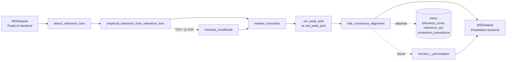

# DAPPLE algorithmic reference

What each operator computes, the equations, the parameters, and the rationale
behind every default. If you want to know how to use the tool, read the
[user guide](userguide.md) first.

DAPPLE's design posture: prefer empirical CDFs over parametric multiples of σ,
prefer permutation nulls over parametric ones, prefer bounded conservative
defaults over ones that optimize annotation count. Everywhere a default is
committed, this document explains why — and what would push you up or down.

---

## Contents

1. [Pipeline overview](#pipeline-overview)
2. [Recommended pipeline](#recommended-pipeline) — the default chain produced by `recommend_pipeline(ep)`
3. [Operator: detect_reference_ions](#operator-detect_reference_ions)
4. [Operator: empirical_tolerance_from_reference_ions](#operator-empirical_tolerance_from_reference_ions)
5. [Operator: msiwarp_recalibrate](#operator-msiwarp_recalibrate)
6. [Operator: lock_mass_recalibrate](#operator-lock_mass_recalibrate)
7. [Operator: median_normalize / tic_normalize / reference_ion_normalize](#operator-median_normalize--tic_normalize--reference_ion_normalize)
8. [Operator: snr_peak_pick](#operator-snr_peak_pick)
9. [Operator: cwt_peak_pick](#operator-cwt_peak_pick)
10. [Operator: kde_consensus_alignment](#operator-kde_consensus_alignment)
11. [Operator: dbscan_consensus](#operator-dbscan_consensus)
12. [Operator: prevalence_fdr_filter](#operator-prevalence_fdr_filter)
13. [Operator: morans_i_permutation](#operator-morans_i_permutation)
14. [Operator: hot_pixel_filter](#operator-hot_pixel_filter)
15. [Operator: background_subtract](#operator-background_subtract)
16. [Cohort harmonization](#cohort-harmonization)
17. [Per-pixel projections](#per-pixel-projections)
18. [Pipeline runner: caching, hashing, RNG](#pipeline-runner-caching-hashing-rng)
19. [Diagnostic rubric & health checks](#diagnostic-rubric--health-checks)
20. [Reproducibility manifest (`.spec.xml`)](#reproducibility-manifest-specxml)
21. [Harmonized imzML round-trip](#harmonized-imzml-round-trip)
22. [Headless CLIs](#headless-clis)

---

## Pipeline overview

A DAPPLE `Pipeline` is a topologically sorted directed acyclic graph (DAG) of
`Node` records. Each `Node` names an operator (registry key), an
immutable `OpParams` dataclass, and an `upstream` list of node ids. Operators
read an `MSIDataset`, optionally read upstream extras (e.g. a `ReferenceSet`
attached by `detect_reference_ions`), and return:

- a new `MSIDataset` (with updated `backend`, possibly different
  `extra` payload, an appended `OpRecord` in `history`)
- a list of `Diagnostic`s (a scalar `summary` dict, an optional `payload` of
  numpy arrays for the threshold-explorer / what-if reasoning, and an optional
  `figure_hint`)



Operators are *idempotent given the same input + params + library versions*.
The `PipelineRunner` exploits that to short-circuit unchanged nodes via a
content-addressed cache. See
[Pipeline runner](#pipeline-runner-caching-hashing-rng).

---

## Recommended pipeline

`recommend_pipeline(ep: ExperimentParams)` builds the default chain from the
ExperimentParams:

| # | Operator | When |
| - | :------- | :---- |
| 1 | `detect_reference_ions` | always |
| 2 | `empirical_tolerance_from_reference_ions` | always |
| 3 | `msiwarp_recalibrate` | TOF / Q-TOF only (Orbitrap / FT-ICR / unknown skip) |
| 4 | `median_normalize` | always (TIC and reference-ion variants are offered) |
| 5 | `snr_peak_pick` or `cwt_peak_pick` | SNR for centroided, CWT for profile |
| 6 | `kde_consensus_alignment` | always |
| 7 | `morans_i_permutation` | tissue samples only (`sample_type == "tissue"`) |

`hot_pixel_filter` and `background_subtract` are not in the default chain.
They're available as opt-in operators you can wedge in via custom pipelines —
the wizard's WorkflowPage will surface them in a future pass.

---

## Operator: `detect_reference_ions`

Module: [`ops/reference_ions.py`](../src/dapple/ops/reference_ions.py)

### Purpose

Identify a small set of m/z values present in many pixels — *reference ions*.
These anchor the empirical tolerance fit and any later recalibration.
Concretely we want anywhere from 5 to a few dozen endogenous peaks (matrix
peaks, common contaminants, internal standards) that recur across the image
with high prevalence.

### Algorithm

Input: a `PeakList`-backed `MSIDataset` with `n_pixels` pixels and a flat
peak list `(mz_data, intensity_data, offsets)`.

1. **Log-space binning.** Define a coarse bin width
   `step = ln(1 + ppm * 1e-6)` where `ppm = coarse_tol_ppm`. Each peak's bin
   index is `floor(log(mz) / step) - bin0`. Log-spacing means a constant ppm
   bin width across the m/z range.

2. **Best peak per (pixel, bin).** Stable-sort all peaks by
   `(pixel, bin, -intensity)` and keep only the first row of each
   `(pixel, bin)` group. This dedups the case where one pixel has multiple
   peaks within `coarse_tol_ppm` of each other — the brightest survives.

3. **Per-bin prevalence.** Count, per bin, how many distinct pixels contributed
   a peak: `bin_count[c] = Σ_pixels 1{any peak in bin c}`. Convert to a
   fraction: `prevalence[c] = bin_count[c] / n_pixels`.

4. **Filter.** Keep bins with `prevalence ≥ min_prevalence` AND
   `bin_count ≥ min_count`.

5. **Merge adjacent bins.** Adjacent kept bins (`merge_adjacent_bins=True`,
   default) are coalesced into one reference ion — handles peaks that straddle
   a bin edge.

6. **Centroid.** For each merged group, the reference m/z is the
   intensity-weighted mean of every contributing peak across every contributing
   pixel:

   $$m/z_\text{ref} = \frac{\sum_{(pixel, peak)} m/z \cdot I}{\sum_{(pixel, peak)} I}$$

7. **Per-pixel ppm error.** For each `(pixel, reference)` pair we compute the
   ppm offset of the pixel's observed m/z (the brightest peak in the merged
   group) from the reference centroid:

   $$\Delta_\text{ppm} = \frac{m/z_\text{observed} - m/z_\text{ref}}{m/z_\text{ref}} \times 10^6$$

   These errors are the empirical foundation of the next operator.

### Output

A `ReferenceSet` is attached to `ds.extra["reference_set"]` with:

- `mz` — sorted reference centroids `(R,) float64`
- `prevalence` — `(R,) float64` in [0, 1]
- `n_observations` — `(R,) int64`, pixel counts
- `per_pixel_mz` — `(n_pixels, R) float64`, NaN where missing
- `per_pixel_intensity` — `(n_pixels, R) float32`, 0 where missing
- `per_pixel_ppm_error` — `(n_pixels, R) float64`, NaN where missing

### Parameters

| Field | Default | Adjustment guidance |
| :---- | :------ | :------------------ |
| `coarse_tol_ppm` | family-aware: 5 (Orbitrap/FT-ICR), 50 (Q-TOF / reflectron TOF), 200 (axial linear MALDI-TOF) | Wider catches more candidates but may merge unrelated peaks. Match to the worst-case ppm error you expect in unrecalibrated data. |
| `min_prevalence` | 0.8 (centroided) / 0.7 (profile) | The fraction of pixels required to call a peak a reference. Lower (0.5) for sparse images; raise (0.95) to be very selective. |
| `min_count` | 5 | Hard floor on supporting pixels. Survey's recommended minimum. |
| `merge_adjacent_bins` | `True` | Disable only when peaks are very dense and you expect them to remain distinguishable at `coarse_tol_ppm`. |

### Diagnostic

`summary`: `n_reference_ions`, prevalence min/median/max,
`coarse_tol_ppm`, `min_prevalence`. `payload`: `reference_mz`,
`prevalence`, `n_observations` arrays.

### Notes on defaults

A minimum of 5 reference ions (`min_count=5`) is the floor below which the
empirical-tolerance bootstrap CIs become unstable. 20 or more is comfortable
for most centroided MALDI-TOF or DESI datasets.

---

## Operator: `empirical_tolerance_from_reference_ions`

Module: [`ops/tolerance.py`](../src/dapple/ops/tolerance.py)

### Purpose

Estimate the per-m/z tolerance — how wide a window around each m/z we need to
include the same analyte across pixels — directly from the data, without
committing to a parametric scaling law (TOF: `1/√m/z`, Orbitrap: `√m/z`, etc.).

### Algorithm

1. Pull per-pixel ppm errors from
   `ds.extra["reference_set"].per_pixel_ppm_error`. Stack into pairs
   `(m/z_centroid, |ppm_error|)`, dropping NaN entries.

2. **Quantile binning.** Sort pairs by m/z and partition into ≤30 quantile
   bins (so each bin has roughly the same number of observations).

3. **Empirical (1 − α/2)-quantile per bin.** For α = 0.01, this is the 99.5th
   percentile of `|ppm_error|` within the bin. Distribution-free — no
   Gaussian assumption.

4. **Pool-Adjacent-Violators (PAV).** Enforce monotone non-decreasing across
   bins by walking left-to-right, pooling any pair that violates monotonicity
   into a weighted average of its members. The result is the smallest function
   that is monotone non-decreasing and has the same average as the input
   within each pooled segment.

5. **Linear interpolation onto a 200-point grid** spanning the observed m/z
   range.

6. **Bootstrap CI.** Repeat steps 1–5 on `bootstrap_B` bootstrap resamples
   of the pixels. By default we use **block bootstrap** (resample whole
   spatial blocks of size `block_size_pixels = 32` rather than independent
   pixels) so the CI respects spatial autocorrelation. The 2.5th and 97.5th
   percentiles across replicates give the CI envelope.

If fewer than 5 valid `(m/z, |ppm|)` pairs are available, the operator falls
back to a flat tolerance equal to the (1 − α/2)-quantile of all available
errors and emits a `warning_flat_tolerance=1.0` summary key.

### Output

A `ToleranceCurve` attached to `ds.extra["tolerance_curve"]`:

- `mz_grid` — `(200,) float64`, ascending
- `ppm_quantile` — `(200,) float64`, the working tolerance
- `ci_low`, `ci_high` — `(200,) float64`, bootstrap 95% CI band
- `evaluate(mz)` — interpolates onto arbitrary m/z queries; downstream
  consumers (consensus alignment, planned recalibration operators) call this.

### Parameters

| Field | Default | Adjustment guidance |
| :---- | :------ | :------------------ |
| `alpha` | 0.01 | Sets coverage; α = 0.01 → 99% coverage. Smaller α → wider tolerance. |
| `bootstrap_B` | 1000 | Drop to 200–500 for speed during iteration; raise to 5000 for very tight CIs. |
| `block_bootstrap` | `True` | Disable only if pixels are demonstrably independent. |
| `block_size_pixels` | 32 | Roughly the spatial scale of your tissue features. Too small under-corrects; too large collapses effective sample size. |

### Notes

The pool-adjacent-violators monotonization is a shape constraint borrowed from
isotonic regression; it ensures tolerance is non-decreasing in m/z without
committing to any particular instrument-physics scaling law (TOF: `1/√m/z`,
Orbitrap: `√m/z`, FT-ICR: `1/m`). The empirical curve will follow whichever
regime actually dominates the user's instrument.

---

## Operator: `msiwarp_recalibrate`

Module: [`ops/recalibrate.py`](../src/dapple/ops/recalibrate.py)

### Purpose

Per-pixel mass-axis correction. Mass drift across an MSI acquisition (thermal,
space-charge, AGC, topography) is the largest single residual in unrecalibrated
TOF / Q-TOF data and can reach tens to hundreds of ppm even on instruments that
were locked at the start of the run. This operator fits a per-pixel piecewise-
linear warp from each pixel's *observed* reference m/z values to the
ReferenceSet's *consensus* centroids, with RANSAC-based outlier rejection so a
single mis-identified anchor doesn't drag the warp.

Recalibration is inserted by `recommend_pipeline` for the TOF families
(`tof_axial`, `tof_reflectron`, `qtof`) where mass drift dominates. Orbitrap and
FT-ICR are locked enough that recalibration adds noise more often than it helps;
the operator's `validate(ep)` warns when called on those families.

### Algorithm

For each pixel:

1. Gather visible `(m/z_observed, m/z_reference)` pairs from
   `ds.extra["reference_set"]`.
2. **RANSAC** over `ransac_n_trials` random size-2 subsets. For each subset,
   fit a linear warp `m/z → m/z'` and count inliers (other anchor pairs whose
   `|ppm residual|` falls below the per-anchor threshold). The anchor threshold
   is taken from the upstream tolerance curve at each anchor's m/z (`2 ×
   ppm_quantile(m/z_ref)` by default), or a user-supplied constant. The trial
   with the most inliers wins; ties broken by smallest residual sum.
3. **Piecewise-linear warp** through the inlier set: sort by m/z_observed,
   build a linear interpolant `f(m/z) = numpy.interp(...)`. Outside the anchor
   range, extrapolate by translation only — the boundary anchor's offset is
   added without scaling, so we don't extrapolate the slope past the data.
4. Apply `f` to every peak m/z in the pixel.

Pixels with fewer than `min_inliers` surviving anchors are left untouched (the
diagnostic records them) — recalibrating from a 2-point linear fit is too
unstable to risk.

### Parameters

| Field | Default | Adjustment guidance |
| :---- | :------ | :------------------ |
| `ransac_threshold_ppm` | 0 (use 2× tolerance curve) | Set explicitly to harden or relax outlier rejection. Smaller = stricter; larger = more anchors retained but noisier fit. |
| `ransac_n_trials` | 64 | With ≥ 5 anchors per pixel this finds a good seed essentially every time; raise only when you have many anchors with heavy contamination. |
| `min_inliers` | 3 | Skip recalibration for any pixel with fewer surviving anchors. Two-point linear fits are unreliable. |

### Diagnostic

- `summary` keys: `n_pixels_recalibrated`, `n_pixels_skipped`,
  `fraction_pixels_recalibrated`, `inliers_median`,
  `pre_residual_median_ppm`, `post_residual_median_ppm`, `improvement_ppm`.
- `payload` arrays: `per_pixel_inliers`, `per_pixel_used`,
  `pre_ppm_residual` and `post_ppm_residual` (full
  `(n_pixels × n_reference_ions)` matrices) so you can compare the residual
  distributions directly.

### Notes

The MSIWarp paper (Eriksson et al., 2020) introduced this approach with
piecewise-linear warps and reported 3–10× residual reduction on TOF-MSI. Our
implementation differs in two places: we use straight RANSAC inlier selection
(simpler than the paper's iterative regularized fit) and we extrapolate by
translation rather than slope past the anchor range (slightly more conservative).

---

## Operator: `lock_mass_recalibrate`

Module: [`ops/recalibrate.py`](../src/dapple/ops/recalibrate.py)

### Purpose

Single-anchor per-pixel m/z shift. Where ``msiwarp_recalibrate`` fits a linear
warp from several reference anchors per pixel, ``lock_mass_recalibrate`` picks
*one* anchor per pixel and shifts every peak in the pixel by the matching
ppm offset.

This is the right choice when:

- Only one reference ion is reliable across the image (a known matrix peak you
  trust, or a deliberately spiked internal standard).
- The dataset has too few anchors per pixel for ``msiwarp``'s linear fit to be
  stable (< 3 visible anchors typical).
- You want a simpler, lower-variance correction than RANSAC + linear fit.

### Algorithm

For each pixel:

1. **Select an anchor** according to ``anchor_strategy``:
   - ``highest_intensity`` (default) — the reference ion with the strongest
     observed signal in this pixel. The most defensible default since
     low-intensity anchors carry larger m/z uncertainty.
   - ``highest_prevalence`` — the globally most-prevalent reference (stable
     across pixels but may be dim in some).
   - ``closest_to_mz`` — whichever reference centroid is nearest
     ``explicit_anchor_mz``. Use when you know the m/z of a stable lock-mass
     molecule.
2. **Compute a multiplicative shift factor** `s = m/z_observed / m/z_reference`.
3. **Refuse the correction** if `|ppm shift| > max_shift_ppm` (default 500).
   This is the operator's defense against single misidentified anchors that
   would otherwise blow up the pixel. Refused pixels are left untouched.
4. **Apply** to every peak: `m/z_new = m/z_old / s`.

The diagnostic records per-pixel `ppm_shift`, the chosen anchor index per
pixel, and an `applied_mask` so you can see exactly which pixels were corrected.

### Parameters

| Field | Default | Adjustment guidance |
| :---- | :------ | :------------------ |
| `anchor_strategy` | `"highest_intensity"` | Switch to ``"closest_to_mz"`` when you have a known stable lock-mass molecule. |
| `explicit_anchor_mz` | 0 (unset) | Required for ``closest_to_mz``. |
| `max_shift_ppm` | 500 | Refuse to apply shifts larger than this. Tighten for high-resolution instruments. |

### Notes

This operator is rarely better than ``msiwarp_recalibrate`` when both apply.
Its main use case is sparse-anchor data and the case where a single
hand-picked lock-mass is all you trust.

---

## Operator: `median_normalize` / `tic_normalize` / `reference_ion_normalize`

Module: [`ops/normalize.py`](../src/dapple/ops/normalize.py)

### Purpose

Make per-pixel intensities comparable across the image by dividing each pixel
by a per-pixel scale factor.

### Algorithm

For each pixel `i` with intensities `I_i = (I_{i,0}, ..., I_{i,n_i-1})`:

- **median**: `f_i = median{ I_{i,j} : I_{i,j} > 0 }` (default).
- **tic**: `f_i = Σ_j I_{i,j}`.

Both fall through to `eps = 1e-12` when the pixel is empty. The pixel's
intensities are replaced with `I_{i,j} / f_i`. m/z values are unchanged.

### Why median is the default

TIC normalization assumes ionization efficiency is roughly constant across
pixels. Real MSI data violates this regularly:

- A saturating analyte in part of the image inflates that region's TIC.
- Matrix-effect heterogeneity (DESI droplet trails, MALDI matrix-crystal
  patches) creates spatial variation in the dominant peak's intensity.
- Vendor exports sometimes pre-normalize TIC at write time; running TIC again
  on already-pre-normalized data is a no-op masquerading as normalization.

The per-pixel non-zero median is robust to a single dominant peak: scaling 5
real peaks by `median(top, mid, mid, mid, low)` is much less skewed by the
"top" than scaling by their sum is.

### Parameters

| Field | Default | Adjustment guidance |
| :---- | :------ | :------------------ |
| `method` | `"median"` | `"tic"` is available but flagged in `validate()`; use only if you have a good reason. |
| `eps` | 1e-12 | Avoids divide-by-zero on empty pixels. Don't change. |

### Diagnostic

Per-pixel factor distribution: `factor_min`, `factor_q25`, `factor_median`,
`factor_q75`, `factor_max`, plus the full `per_pixel_factor` array as
payload.

### `reference_ion_normalize`

A third normalization variant. Per-pixel scale factor is the **sum of
intensities at the reference ions** that ``detect_reference_ions`` picked
upstream:

  `f_i = max( Σ_r I_{i, r}, eps )`

with the sum taken over reference ions `r ∈ ReferenceSet`. It's a defensible
alternative to median when matrix peaks (or other endogenous standards) are
stable across the image: their summed intensity is a per-pixel readout of
ionization efficiency that doesn't depend on analyte abundance the way TIC does.

Caveat surfaced by `validate(ep)`: on heterogeneous tissue with locally variable
matrix coverage the reference-ion sum itself varies with the matrix-covered
fraction of the pixel, which can over-correct. Median is still the safer default
in those cases.

### Notes

The methodology literature on MSI normalization is consistent on this point:
TIC fails on most non-trivial samples; per-pixel median (or per-pixel
reference-ion sum, when available) is the appropriate default for tissue
imaging.

---

## Operator: `snr_peak_pick`

Module: [`ops/peak_pick.py`](../src/dapple/ops/peak_pick.py)

### Purpose

Filter centroided peak lists to those above a per-pixel noise floor. Already-
centroided data has been peak-picked once by the vendor; this operator drops
spurious low-intensity peaks that snuck through.

### Algorithm

For each pixel `i`:

1. Compute the **median absolute deviation** of intensities:
   `MAD_i = median(|I_i - median(I_i)|)`.
2. Convert to a robust σ estimate: `σ_i = 1.4826 · MAD_i`. The 1.4826 factor
   makes MAD a consistent σ estimator under Gaussianity, but we don't actually
   require Gaussianity — we just use it as a robust scale.
3. Threshold: `T_i = max(snr_mad · σ_i, q_i, T_abs)` where
   `q_i = quantile(I_i, min_intensity_quantile)` and `T_abs = min_intensity_abs`.
4. Keep peaks with `I_{i,j} > T_i`.

The cumulative peak count drops; the dataset's `PeakList` is rebuilt with the
surviving peaks and updated `offsets`.

### Why empirical-quantile, not k·σ

Mass-error and intensity distributions in real MSI data are heavy-tailed
(detector dead-time, ringing artifacts, AGC overshoot in trap instruments,
matrix-crystal heterogeneity). A parametric `k·σ` cutoff under a Gaussian
assumption misses ~5–10% of true signal in the tail and mis-prices outliers.
The MAD-σ estimator combined with an optional empirical-quantile floor avoids
the Gaussian assumption while still giving a robust per-pixel scale.

### Parameters

| Field | Default | Adjustment guidance |
| :---- | :------ | :------------------ |
| `snr_mad` | 3.0 | Higher → stricter (5–10 to be very conservative); lower → keep more peaks at risk of admitting noise. |
| `min_intensity_quantile` | 0.0 (disabled) | 0.5 keeps top half of every pixel's peaks; 0.95 keeps top 5%. Useful when upstream is loose. |
| `min_intensity_abs` | 0.0 (disabled) | Hard floor in the dataset's current intensity units. Set when you know the noise floor in absolute terms. |

### Diagnostic

`fraction_kept`, kept-per-pixel distribution, threshold distribution. Payload
contains `per_pixel_threshold` and `per_pixel_kept_count`.

### Notes

For profile data the appropriate picker is `cwt_peak_pick` (next section); SNR
thresholding on profile data treats every sample point as a candidate peak,
which is rarely useful.

---

## Operator: `cwt_peak_pick`

Module: [`ops/peak_pick.py`](../src/dapple/ops/peak_pick.py)

### Purpose

Pick peaks from profile-mode (continuous) intensity traces. Where
``snr_peak_pick`` *trims* an already-centroided peak list, ``cwt_peak_pick``
does the centroiding itself: it runs a Ricker-wavelet continuous-wavelet
transform across the trace, finds positions where the CWT coefficient at one
or more wavelet widths peaks, and emits one (m/z, intensity) per detected peak.

### Algorithm

For each pixel:

1. **Resample onto a uniform log-m/z grid.** A constant ppm width is uniform on
   the resampled axis, which makes the wavelet widths agnostic to absolute m/z.
   Grid step is `ln(1 + grid_ppm_step · 1e-6)` ≈ `grid_ppm_step · 1e-6` per
   sample.
2. **Build wavelet widths** that span the configured ppm range:
   `widths = linspace(log_min_w / log_step, log_max_w / log_step, n_widths)`.
   These map ppm-space peak FWHMs to grid-sample widths.
3. **Run** ``scipy.signal.find_peaks_cwt(resampled, widths=..., min_snr=...,
   noise_perc=...)``. Returned peak indices are positions on the log grid.
4. **Sub-grid centroid.** For each detected peak, compute the
   intensity-weighted mean of m/z within ±width samples of the peak index. This
   gives a sub-sample-accurate m/z; height is the maximum within the same window.

### Parameters

| Field | Default | Adjustment guidance |
| :---- | :------ | :------------------ |
| `width_min_ppm` | 20 | Should be smaller than the narrowest peak you expect — typically 10–30 ppm on Q-TOF / reflectron TOF, 1–3 ppm on Orbitrap. |
| `width_max_ppm` | 120 | Should be at least as large as the broadest real peak you expect. Raise to 500 for axial linear MALDI-TOF. |
| `n_widths` | 8 | Wavelet widths to try, log-spaced between min and max. 16 if narrow peaks are being missed. |
| `grid_ppm_step` | 5 | Tighter grid → sharper centroids but more compute. Should be smaller than ``width_min_ppm``. |
| `min_snr` | 3 | scipy ``find_peaks_cwt`` SNR floor; raise to 5 for stricter picking. |
| `noise_perc` | 10 | CWT-coefficient percentile used as the noise floor. Raise to 25 if real signals are themselves dense. |

`recommend_pipeline` selects ``cwt_peak_pick`` when
`ExperimentParams.profile_or_centroided == "profile"`. Defaults are family-aware:
Orbitrap / FT-ICR get tighter widths and a finer grid; axial linear MALDI-TOF
gets much wider widths.

### Diagnostic

`summary` keys: `n_peaks_total`, kept-per-pixel min/median/max,
``grid_size``, ``n_widths``, ``min_snr``. Payload: ``per_pixel_kept_count``.

### Notes

Profile-mode peak picking is fundamentally an interpolation problem (true peak
m/z lies between sampled points), so the sub-grid centroid step matters as much
as the CWT itself. ``find_peaks_cwt`` only gives an integer index; without
centroid refinement the picked m/z would be quantized to the grid step.

---

## Operator: `kde_consensus_alignment`

Module: [`ops/consensus.py`](../src/dapple/ops/consensus.py)

### Purpose

Pool peaks from every pixel into one global density, find the dense regions
(consensus peaks), and then build a `(n_pixels, n_peaks)` intensity matrix by
assigning each pixel's peaks to the nearest consensus channel. This is the
hyperspectral-cube-construction step.

### Algorithm

1. **Pool peaks in log-m/z.** Concatenate every pixel's peaks. Take the
   natural log of m/z so a constant ppm bandwidth is uniform across the m/z
   range:

   $$x = \ln(m/z), \quad w = I$$

2. **Weighted Gaussian KDE.** Bandwidth in log space:
   `bw = bandwidth_ppm * bandwidth_scale * 1e-6`. The use of `1e-6` and
   log-space comes from the small-x identity `ln(1 + x) ≈ x` — a `bandwidth_ppm`
   of 50 corresponds to a Gaussian SD of `5e-5` in log-m/z, which is exactly
   50 ppm in linear m/z to first order.

   Evaluate the KDE on a regular log-m/z grid of `n_grid_points` points,
   padded by `5 · bw` past the data range to avoid boundary bias (the kernel
   spilling off the edge would otherwise underestimate density at boundary
   peaks):

   $$\hat{f}(x_g) = \frac{1}{\sqrt{2\pi}\, bw\, \sum_i w_i} \sum_i w_i \exp\left(-\frac{(x_g - x_i)^2}{2 bw^2}\right)$$

   The implementation truncates the kernel at ±5σ via a binary search on the
   sorted log-m/z values, so the cost is O((n + g) log n) rather than O(n·g).

3. **Find local maxima.** Indices `i` where
   `density[i-1] < density[i] > density[i+1]`. We record **all** local
   maxima for the rejection-budget diagnostic — see below.

4. **Prominence filter.** Keep maxima whose density exceeds
   `quantile(density, min_prominence_quantile)` (default 0.5, the median
   density). Maxima below the threshold are dropped.

5. **Per-pixel assignment.** For each candidate consensus m/z `c_k`, the
   tolerance window is
   `c_k · (1 ± tol_k · 1e-6)` where `tol_k` is the empirical tolerance from
   `ds.extra["tolerance_curve"]` evaluated at `c_k`, or `default_tol_ppm` if
   no curve is attached. For each peak we look up the two nearest consensus
   m/z values via `searchsorted`; if either's window contains the peak, we
   assign the peak to that consensus and keep the **maximum** intensity per
   `(pixel, consensus)` pair via `np.maximum.at`.

6. **Prevalence filter.** A consensus channel's prevalence is
   `(matrix[:, k] > 0).sum() / n_pixels`. Drop channels with
   `prevalence < min_prevalence` (default 0.05). The pre-filter prevalence
   array is preserved in the diagnostic so the threshold explorer can answer
   "how many channels would survive at threshold X?" without re-running.

7. **Output.** A `PeakMatrix` backend with the surviving channels, sorted by
   m/z. `ds.extra["consensus_prevalence"]` carries the per-channel prevalence
   for the ChannelsPanel and downstream operators.

### Rejection budget — re-thresholding without sweeps

`KdeConsensusAlignment` records the full pre-filter state in its diagnostic:

- `all_local_max_density` — every local maximum's density (pre prominence
  filter)
- `prominence_threshold_value` — the actual quantile-based threshold used
- `all_candidate_mz`, `all_candidate_prevalence`,
  `all_candidate_max_intensity` — every post-prominence candidate

Combined with `n_local_maxima_total`, `n_rejected_by_prominence`,
`n_post_prominence`, `n_rejected_by_prevalence` in the summary, you can
ask:

- *"If I raise `min_prevalence` to 0.1, how many channels survive?"* →
  `(all_candidate_prevalence >= 0.1).sum()`
- *"What if `min_prominence_quantile` were 0.7?"* →
  `(all_local_max_density > quantile(all_local_max_density_distribution, 0.7)).sum()`

A future panel will surface this as live sliders.

### Parameters

| Field | Default | Adjustment guidance |
| :---- | :------ | :------------------ |
| `n_grid_points` | 32768 | More → sharper detection but slower. ~21 ppm spacing across 200–800 m/z. |
| `bandwidth_ppm` | 50 (Q-TOF/reflectron); 5 (Orbitrap/FT-ICR); 200 (axial TOF) | Match to per-pixel m/z scatter. Tighten if peaks are unusually well-resolved; widen if drift is large. |
| `bandwidth_scale` | 1.0 | Multiplier on `bandwidth_ppm`. < 1 sharpens, > 1 merges. Prefer this knob over editing `bandwidth_ppm`. |
| `min_prominence_quantile` | 0.5 (median density) | Raise to 0.7–0.9 for stricter selection. |
| `default_tol_ppm` | family-aware (5 / 50 / 200) | Used only when no `tolerance_curve` is upstream. |
| `min_prevalence` | 0.05 | Drop peaks present in < 5% of pixels. A permutation-FDR alternative is planned. |

### Notes

The conservative `min_prevalence` floor applied here can be replaced (or
followed) by the empirical permutation-FDR test
[`prevalence_fdr_filter`](#operator-prevalence_fdr_filter), which adapts to
each channel's total peak count rather than imposing a fixed prevalence
threshold across all channels.

---

## Operator: `dbscan_consensus`

Module: [`ops/dbscan_consensus.py`](../src/dapple/ops/dbscan_consensus.py)

### Purpose

An alternative to ``kde_consensus_alignment`` for the case where the KDE's
bandwidth selection is unstable — sparse peak lists, very low pixel counts, or
spectra where genuine peaks are too close together for a smooth density to
separate them. DBSCAN clusters individual peaks directly without ever forming a
density estimate, so a small number of well-separated clusters is detected
robustly.

### Algorithm

1. **Pool peaks in log-m/z.** Concatenate every pixel's peaks to a flat
   `(n_total,)` array of `x = ln(m/z)`.
2. **Compute eps.** ``eps_ppm`` defaults to ``0`` which means *use 2× the
   median of the upstream tolerance curve*; if no tolerance curve is upstream
   the fallback is 50 ppm. The clustering distance is then
   ``eps = eps_ppm · 1e-6`` in log-m/z (since `ln(1+x) ≈ x` for small x).
3. **Run scikit-learn's ``DBSCAN``** with ``min_samples`` and the computed
   ``eps``. Each cluster (label ≥ 0) becomes one consensus peak. Noise points
   (label −1) are dropped.
4. **Centroid each cluster** as the intensity-weighted mean of its peaks (in
   linear m/z, not log-m/z), and record the cluster's prevalence (fraction of
   distinct pixels contributing).
5. **Prevalence filter.** Drop clusters with prevalence below
   ``min_prevalence`` (default 0.05).
6. **Per-pixel assignment.** Identical to ``kde_consensus_alignment``: each
   peak is assigned to the nearest consensus channel within its tolerance
   window; the maximum intensity per ``(pixel, channel)`` pair is kept.

### Parameters

| Field | Default | Adjustment guidance |
| :---- | :------ | :------------------ |
| `eps_ppm` | 0 (use 2× tolerance curve median) | Set to a fixed ppm if you don't trust the upstream tolerance fit. |
| `min_samples` | 5 | DBSCAN's core-point threshold. With fewer pixels lower this to 3. |
| `min_prevalence` | 0.05 | Same role as in KDE consensus. |

### Diagnostic

`summary` keys: `n_clusters_total`, `n_clusters_kept`, `n_noise_points`,
`eps_ppm_effective`, `min_samples`. `payload`: `cluster_mz`,
`cluster_prevalence`, `cluster_size`.

### When to choose DBSCAN over KDE

| Symptom | Pick |
| :------ | :--- |
| Smooth, dense peak distributions; many pixels | KDE |
| Sparse pools (few hundred peaks total); KDE bandwidth produces over-merged channels | DBSCAN |
| Want a hard "this peak belongs to that cluster" assignment without a continuous density | DBSCAN |
| Want to model peaks as belonging to a continuous m/z neighborhood with soft membership | KDE |

DBSCAN is also faster than KDE on small pools because it avoids the O(n_grid)
density evaluation, but loses to KDE on large pools because of its
neighborhood graph. The two tend to agree to within ±2 channels on the synth
fixture (5 planted peaks, 25 pixels).

---

## Operator: `prevalence_fdr_filter`

Module: [`ops/prevalence_filter.py`](../src/dapple/ops/prevalence_filter.py)

### Purpose

Empirical replacement for the conservative ``min_prevalence`` floor inside
the consensus operators. Tests, per channel, whether the observed prevalence
is higher than the random-placement null would produce — and drops channels
that fail to reject.

Why this is better than a fixed threshold: a flat ``min_prevalence = 0.05``
treats all channels alike, but the right floor depends on how many *peaks*
the channel has. A channel with 200 peaks placed at random across 200 pixels
fills ~63% of pixels by pure chance, so observing 5% prevalence there is
*below* the null (noise). A channel with 5 peaks placed at random fills
~2.5%, so observing 5% prevalence is well above the null (signal). The FDR
test scales the bar per channel; a fixed floor cannot.

### Algorithm

Inputs:

- `ds.backend.matrix`: dense `(n_pixels, n_channels)` float32 PeakMatrix.
- `ds.extra["consensus_n_peaks_per_channel"]`: `(n_channels,) int64` —
  total peak-to-pixel assignments per channel, recorded by the upstream
  consensus operator (KDE or DBSCAN).

For each channel `c`:

1. **Observed statistic.** `p_obs(c) = (matrix[:, c] > 0).sum() / n_pixels` —
   fraction of pixels with non-zero intensity at channel c.

2. **Null model.** Place `k_c` peaks uniformly at random into `n_pixels` bins
   ("occupancy problem"). Count distinct bins; divide by `n_pixels` to get
   the null's prevalence. Under the null, the expected occupancy is

   $$
   \mathbb{E}[p_\text{null}(c)] \;=\; 1 - (1 - 1/n_\text{pixels})^{k_c}
   $$

3. **Monte Carlo.** Sample B (default 499) realizations of the null per
   channel. Vectorized per-channel: allocate `(B, n_pixels)` bool, scatter
   `B*k_c` uniform pixel indices, sum along axis 1 for distinct counts.

4. **Right-tail empirical p-value** with the +1/+1 stabilizer:

   $$
   p_c \;=\; \frac{|\{b : p_\text{null}^{(b)}(c) \ge p_\text{obs}(c)\}| + 1}{B + 1}
   $$

5. **Benjamini–Hochberg adjustment** across channels.

6. Drop channels with `q_c >= q_threshold` (default 0.05).

### Output

`MSIDataset` with a `PeakMatrix` backend trimmed to surviving channels.
Companion arrays in `ds.extra` (`consensus_prevalence`,
`consensus_n_peaks_per_channel`) are subset to match. Diagnostic payload
carries `p_values`, `q_values`, `kept_mask`, `channel_mz_in`, `k_per_channel`,
`p_obs`.

### Parameters

| Field | Default | Adjustment guidance |
| :---- | :------ | :------------------ |
| `n_permutations` | 499 | p-value resolution ~ 1/(B+1). Drop to 99 for fast iteration; raise to 1999 when N_channels > 1000. |
| `q_threshold` | 0.05 | Standard FDR floor. Raise to 0.1 for permissive; lower to 0.01 for strict. |
| `min_pixels_for_test` | 64 | Below this the null is too coarse to discriminate — operator passes through. |
| `rng_seed` | 0 | Mixed with global pipeline seed for deterministic re-runs. |

### Diagnostic

`summary` keys: `n_channels_in`, `n_channels_out`, `n_dropped_by_fdr`,
`n_permutations`, `q_threshold`, `p_value_min/median`, `q_value_min/median`.
`warning_conservative_fallback=1.0` is set when
`consensus_n_peaks_per_channel` is missing from `ds.extra` (the operator
falls back to using the observed pixel count, yielding a conservative test).

`figure_hint`: `histogram:prevalence_fdr_q_values` — distribution of BH-FDR
q-values across channels with a vertical line at the threshold.

### When to use

- After consensus alignment, on any PeakMatrix-backed dataset.
- Especially when channel counts span a wide range — fixed-floor
  ``min_prevalence`` over-rejects sparse channels and under-rejects dense
  ones.
- Before ``morans_i_permutation``: this filter removes prevalence-noise
  channels (which Moran's I would call "no spatial structure" anyway); after
  this filter, Moran's I has fewer channels to test, sharpening its FDR.

### Caveats

- The null assumes peaks are placed *independently* across pixels. If your
  data has strong spatial structure, the null is appropriate (we're testing
  for above-random prevalence, structure handled separately).
- Computational cost is O(B * Σ k_c) — manageable up to a few thousand
  channels each with a few hundred peaks.

---

## Operator: `morans_i_permutation`

Module: [`ops/spatial_filter.py`](../src/dapple/ops/spatial_filter.py)

### Purpose

Drop consensus channels whose pixel-level intensity pattern is indistinguishable
from random. After consensus alignment, many of the surviving channels are
genuinely spatially structured (a metabolite localized to one tissue region,
say); others are noise that snuck through the prevalence floor. Moran's I tests
each channel for spatial coherence; channels with no coherence are dropped.

`recommend_pipeline` inserts this operator only when
`ExperimentParams.sample_type == "tissue"` — cell culture and dispersed samples
don't have the spatial coherence that the test assumes.

### Algorithm

For each consensus channel `c`:

1. **Compute Moran's I** on the spatial intensity distribution. Let `x` be the
   per-pixel intensity vector for channel c, `x̄` its mean, and `W` the binary
   adjacency matrix of the raster (queen = 8 neighbors, rook = 4):

   $$I_c = \frac{n}{S_0} \cdot \frac{(x − \bar{x})^\top W (x − \bar{x})}{(x − \bar{x})^\top (x − \bar{x})}$$

   with `S_0 = Σ_ij W_ij`. Positive `I` indicates spatial clustering of similar
   values; negative indicates dispersion; near-zero indicates no spatial
   structure.
2. **Permutation null.** Globally shuffle pixel labels `B` times (the same
   shuffle is applied to every channel each iteration); recompute `I` after each
   shuffle. The empirical two-sided p-value is the fraction of permutations
   whose `|I_perm|` exceeds `|I_obs|`, with a +1/+1 stabilizer.
3. **Benjamini–Hochberg FDR adjustment** of the p-values across all channels.
4. Channels with `q_value ≥ q_threshold` are dropped.

### Parameters

| Field | Default | Adjustment guidance |
| :---- | :------ | :------------------ |
| `n_permutations` | 499 | Resolution ~1/(B+1). 199 for fast iteration; 1999 for tighter p-values when N_channels > 1000. |
| `q_threshold` | 0.05 | Standard FDR floor. Raise to 0.1 to be permissive; lower to 0.01 to keep only strong-and-confident channels. |
| `neighborhood` | `"queen"` | Queen (8 neighbors) is more permissive at honoring fine diagonal features. Use rook (4) when pixels are anisotropic. |
| `min_pixels_for_test` | 64 | Skip the test on tiny datasets where Moran's I is unstable. |

### Diagnostic

- `summary`: `n_channels_in`, `n_channels_out`, `n_dropped_by_fdr`,
  `n_permutations`, observed-I min / median / max, `q_threshold`.
- `payload`: per-channel `I_obs`, `p_values`, `q_values`, `kept_mask`, plus
  the original `channel_mz_in`. Sufficient to re-threshold the q-cut after the
  fact.

### Notes

We use a permutation null rather than the analytic moments of Moran's I
(Cliff & Ord 1981) because real MSI intensity distributions are heavy-tailed —
the analytic moments assume symmetry that doesn't hold and over-reject in the
positive-I tail. The +1/+1 stabilizer in the empirical p-value avoids p = 0
artifacts when no permutation is more extreme than the observation.

---

## Operator: `hot_pixel_filter`

Module: [`ops/hot_pixel.py`](../src/dapple/ops/hot_pixel.py)

### Purpose

Detect and correct single-pixel intensity spikes — detector glitches,
charge-spikes, matrix-crystal artifacts. Hot pixels dominate auto-contrast
bounds, skew per-pixel normalization, and create one-pixel "consensus peaks".

### Algorithm

1. **TIC threshold** computed across populated pixels only:

   $$T = \text{median}(\text{TIC}) + k_\text{MAD} \cdot 1.4826 \cdot \text{MAD}(\text{TIC})$$

   Pixels with `TIC > T` are flagged.

2. **Correction**, controlled by `correction`:

   - **`zero`**: every intensity at the hot pixel is set to 0.
   - **`neighbors_median`**: scale the hot pixel's intensities so its TIC
     matches the median TIC of its 8 spatial neighbors (excluding any
     neighbors that are themselves hot). Preserves peak counts and m/z
     values; just kills the spike. Falls back to `zero` if fewer than
     `min_neighbors` valid neighbors exist (e.g. at the image edge).
   - **`mark`**: don't mutate intensities; just record the hot-pixel indices
     in `ds.extra["hot_pixel_indices"]` so downstream operators can mask.

3. The threshold value is also recorded in `ds.extra["hot_pixel_threshold_tic"]`
   so the threshold explorer can re-pick `k_mad` against the recorded
   `per_pixel_tic` array without re-running.

### Parameters

| Field | Default | Adjustment guidance |
| :---- | :------ | :------------------ |
| `k_mad` | 5.0 | Drop to 3 to catch more spikes (but more false positives on real hotspots); raise to 8–10 to catch only extreme glitches. |
| `correction` | `"neighbors_median"` | The conservative default. |
| `min_neighbors` | 3 | Only relevant for `neighbors_median`. |

### Diagnostic

`n_hot_pixels`, `fraction_hot`, `tic_median`, `tic_mad`, `tic_threshold`.
Payload: `per_pixel_tic` (the full distribution), `hot_pixel_indices`.

---

## Operator: `background_subtract`

Module: [`ops/background.py`](../src/dapple/ops/background.py)

### Purpose

Remove or attenuate consensus channels that are present in background pixels
at intensity comparable to or larger than their foreground intensity. These
channels are typically matrix peaks, contaminants, or off-tissue analyte
that we don't want confounding the foreground analysis.

### Algorithm

Requires:

- `PeakMatrix` backend (post-consensus alignment)
- At least one ROI on `ds.rois`. If a `is_background=True` polygon exists,
  use that as the background population. If only foreground polygons are
  drawn AND `use_outside_as_bg=True`, treat every populated pixel outside
  the foreground as background. If only a background polygon is drawn,
  treat the rest as foreground.

For each consensus channel `c`:

1. `μ_fg(c) = mean(matrix[fg_mask, c])`
2. `μ_bg(c) = mean(matrix[bg_mask, c])`
3. `r(c) = μ_bg(c) / max(μ_fg(c), eps)`

Then either:

- **`reject_channels`** (default): keep channels with
  `r(c) < bg_to_fg_ratio_threshold`. Drops the contaminated channels;
  preserves the foreground intensities exactly.
- **`subtract`**: replace each pixel's intensity with
  `max(0, intensity - μ_bg(c))`. Preserves channel count but mutates
  intensities; only safe when the background is uniform across the image.

### Parameters

| Field | Default | Adjustment guidance |
| :---- | :------ | :------------------ |
| `mode` | `"reject_channels"` | Conservative: doesn't touch foreground intensities. |
| `bg_to_fg_ratio_threshold` | 0.5 | Drop channels with `μ_bg ≥ 0.5 · μ_fg`. Lower (0.2) for stricter; raise (0.8) to keep more. |
| `use_outside_as_bg` | `True` | Off-foreground ↦ background fallback. |
| `eps` | 1e-9 | Avoids divide-by-zero. |

### Diagnostic

`n_channels_in/out`, `n_fg_pixels`, `n_bg_pixels`, `ratio_median`,
`ratio_max`. Payload: `fg_mean`, `bg_mean`, `ratios`, `channel_mz` —
enough to re-pick `bg_to_fg_ratio_threshold` interactively.

---

## Cohort harmonization

Module: [`cohort/align.py`](../src/dapple/cohort/align.py)

### Purpose

Harmonize a *cohort* of MSI datasets onto a single shared m/z axis so they can
be compared, contrasted, or co-clustered downstream. The single-dataset
``kde_consensus_alignment`` operator only sees one image at a time; if you run
it independently on dataset A and dataset B, the two output PeakMatrix
backends will have *different* m/z axes (each axis is fit to its own image),
making cross-dataset comparison brittle.

``align_cohort`` computes one shared consensus axis from all datasets together,
then expresses every dataset on that axis. The result is a list of MSIDatasets
each with the same number of channels in the same order, suitable for stacking
into a `(n_datasets, n_pixels_per_dataset, n_channels)` tensor for
downstream cohort-level analysis.

### Algorithm

For each dataset independently:

1. **Reference detection** with ``DetectReferenceIons`` (own params).
2. **Empirical tolerance** with ``EmpiricalToleranceFromReferenceIons`` (own
   reference set).
3. **Optional per-dataset recalibration** with ``MsiwarpRecalibrate`` when
   ``recalibrate=True`` (default). Each dataset is recalibrated against its
   own reference set — drift is corrected *before* pooling.
4. **Per-pixel normalization** with ``MedianNormalize``.
5. **Per-pixel peak picking** with ``SnrPeakPick`` (centroided) or
   ``CwtPeakPick`` (profile, picked from each dataset's metadata).

After per-dataset preprocessing, all picked peaks (across all pixels of all
datasets) are pooled into a single weighted (intensity-weighted) sample. A
single KDE consensus is fit on the pooled cloud — this is the **shared
consensus axis**, identical across the cohort. Each dataset is then projected
onto that axis using its own picked peaks: for every pixel, for every
consensus m/z, the maximum intensity within the consensus channel's tolerance
window is recorded. Output is a `PeakMatrix` per dataset, all sharing the same
`mz_axis`.

### Per-dataset metadata

Each output dataset carries:

- ``extra["cohort_dataset_index"]`` — its position in the input list
- ``extra["cohort_size"]`` — total cohort size

so that downstream operators or analysis code can re-identify cohort members
and scope their reductions.

### Parameters (`CohortAlignParams`)

| Field | Default | Adjustment guidance |
| :---- | :------ | :------------------ |
| `bandwidth_ppm` | 50 | Same role as in KDE consensus. Tighten when cohort drift is small; widen when drift dominates. |
| `min_prevalence` | 0.5 | The fraction of *cohort pixels* required to keep a consensus channel. Higher than the single-dataset default because cohort pooling already smooths sparsity. |
| `min_prominence_quantile` | 0.5 | Inherited from KDE consensus. |
| `recalibrate` | `True` | Per-dataset MSIWarp before pooling. Disable only if your datasets are already recalibrated or if MSIWarp is known to fail on your instrument family. |

### Output (`CohortAlignResult`)

A frozen dataclass with:

- `aligned_datasets` — list of `MSIDataset` with `PeakMatrix` backends
- `shared_consensus_mz` — `(K,) float64`, the shared m/z axis
- `cohort_prevalence` — `(K,) float64`, fraction of *all cohort pixels* with
  signal in each channel
- `per_dataset_prevalence` — `dict[int, (K,) float64]`, per-dataset prevalence
- `diagnostics` — summary dict (`n_datasets`, `n_total_pixels`,
  `n_total_peaks_pooled`, `n_consensus_shared`, `cohort_prevalence_median`)

### Loading a cohort

`load_cohort_directory(root, pattern="*.imzML", recursive=True)` walks the
directory and reads every matching file. Files are returned sorted by name.
Use this when your cohort is organized as `cohort_root/{run1.imzML,
run2.imzML, ...}`.

### Notes

The pooled-consensus approach is the simplest defensible cohort harmonization:
each dataset is fit, recalibrated, and picked independently (so per-dataset
issues don't bleed into other datasets), and the only cross-dataset step is
pooling for the shared axis.

A more aggressive alternative — fitting a *single* global tolerance curve and
recalibration warp from cross-dataset reference intersections — is not yet
implemented. It would be slightly more powerful when the cohort spans the same
instrument run with consistent reference ions, but is fragile when the cohort
mixes instruments or sample types. The current approach is conservative and
extends to mixed-cohort settings without changes.

---

## Per-pixel projections

Module: [`data/dataset.py`](../src/dapple/data/dataset.py),
[`viz/projections.py`](../src/dapple/viz/projections.py)

The projections rendered by the **Preview**, **ChannelsPanel**, and any
direct call to `MSIDataset.project(kind)`.

For a `PeakList`-backed dataset, projections reduce each pixel's peak list to
a scalar:

| Kind | Computation |
| :--- | :---------- |
| `tic` | `Σ_j I_{i,j}` |
| `rms` | `sqrt( mean( I_{i,j}^2 : I_{i,j} > 0 ) )` |
| `median` | `median{ I_{i,j} : I_{i,j} > 0 }` |
| `base_peak` | `max_j I_{i,j}` |
| `peak_count` | `n_i` (length of the pixel's peak list, including any zero-intensity entries) |
| `mean_mz` | `(Σ_j m/z_{i,j} I_{i,j}) / Σ_j I_{i,j}` |

`mean`, `median`, and `rms` deliberately skip zero-intensity entries.
Vendor centroided exports — notably Xcalibur ANDI-MS — flank every detected
peak with zero-intensity sentinels marking peak edges. On the supplied Boone
DESI dataset, ~56% of every pixel's intensity entries are vendor zeros; a
plain median collapsed to 0 everywhere before this carve-out.

For a `PeakMatrix`-backed dataset (post-consensus), the same scalars are
computed across the dense matrix axes; zeros there mean "no peak detected at
this consensus channel" and are kept in the reduction.

The scalars are scattered onto a `(H, W)` raster via `project_to_grid`, with
0 in cells where no pixel exists. Image layers in napari use 1st-99th
percentile contrast on the **non-zero** values so an empty-pixel background
doesn't compress the visible signal into a single color.

---

## Pipeline runner: caching, hashing, RNG

Module: [`pipeline/runner.py`](../src/dapple/pipeline/runner.py)

### Cache key

For each node, the runner computes:

```
cache_key = sha256( op_name | params_hash | input_dataset_hash | library_versions_hash )
```

where `params_hash` is the canonical SHA-256 of the params dataclass (handled
by `data/hashing.py::hash_obj` with sorted-key JSON normalization),
`input_dataset_hash` is `MSIDataset.hash()` (combines the dataset identity
hash with all upstream `OpRecord.output_hash` values), and
`library_versions_hash` snapshots installed versions of numpy/scipy/pyimzml
and friends.

If the cache key has been seen, the cached `MSIDataset` and diagnostics are
returned without re-running. So when you go Back in the wizard, edit
`bandwidth_ppm`, and Run again, only the consensus node re-executes — the
upstream four are served from cache.

### RNG

Per-node RNGs are derived deterministically from the master seed and node id:

```python
seed_node = int(sha256( {seed: master, node: id} ).hex[:16], 16) & 0xFFFFFFFF
rng = numpy.random.default_rng(seed_node)
```

So the bootstrap CIs from `empirical_tolerance_from_reference_ions` and the
permutation tests in future operators are reproducible across re-runs given
the same `master_seed` and node id.

### Re-runs honor the original input

The wizard snapshots the dataset **before** the pipeline runs and feeds that
snapshot to every re-run, regardless of whether `session.dataset` has been
overwritten with a post-consensus PeakMatrix from a previous run. So
"Back ▸ tweak ▸ Run again" always pipes the original PeakList through
reference detection, not the post-consensus matrix.

---

## Diagnostic rubric & health checks

Module: [`pipeline/diag_format.py`](../src/dapple/pipeline/diag_format.py)

Every operator emits a `Diagnostic` whose `summary` is a flat
`dict[str, float]` of scalar metrics (counts, fractions, residual ppm, ...).
These are dumped to the wizard's RunPage log, the `dapple-apply-spec` CLI
output, and the `dapple-cohort-align` CLI output through one shared formatter
that:

- **Aligns rows** in a tabular `key .... value` layout, with a dotted leader
  between label and value for visual scanning.
- **Grades** each value via a per-key `Rubric` registry (`RUBRICS` for
  per-node summaries, `COHORT_RUBRICS` for cohort summaries) that knows
  what's healthy / borderline / unhealthy. The grade is rendered as a glyph
  (✓ / ⚠ / ✗) with the threshold the decision was based on (e.g.
  ``≥ 0.50``).
- **Footers expand each flagged metric into actionable guidance**:
  `what:` (one sentence on what the value represents) +
  `fix:` (the specific parameter to adjust and what to change it to).
  Different severity levels get different `fix:` text — `warn_advice` is
  gentler than `bad_advice`.

### Rubric structure

```python
@dataclass(frozen=True)
class Rubric:
    label: str                                    # pretty column name
    fmt: str                                      # "{:.0f}", "{:.1%}", ...
    healthy: Callable[[float], bool] | None       # → ✓ glyph
    warning: Callable[[float], bool] | None       # → ⚠ glyph
    bad: Callable[[float], bool] | None           # → ✗ glyph
    healthy_hint: str                              # shown next to ✓ ("≥ 5")
    meaning: str                                   # what the value represents
    warn_advice: str                               # action when ⚠
    bad_advice: str                                # action when ✗
```

A grade-priority of `bad → warning → healthy` means the formatter picks the
most-severe predicate that fires; the others are silent.

### Coverage

The rubric registry covers ~30 summary keys spanning every default-pipeline
operator plus the cohort flow. Highlights:

| Operator | Key | Healthy if | Notes |
| :------- | :-- | :--------- | :---- |
| `detect_reference_ions` | `n_reference_ions` | ≥ 5 | Below 3 disables msiwarp + flat-tolerance fallback fires |
| `detect_reference_ions` | `prevalence_min` | ≥ 0.50 | Bracket of weakest-anchor prevalence |
| `detect_reference_ions` | `prevalence_median` | ≥ 0.70 | Central anchor strength |
| `empirical_tolerance_from_reference_ions` | `warning_flat_tolerance` | absent | Fallback when < 5 (m/z, ppm) pairs |
| `msiwarp_recalibrate` | `fraction_pixels_recalibrated` | ≥ 0.90 | Below 0.6 means recalibration is doing little |
| `msiwarp_recalibrate` | `inliers_median` | ≥ 5 | Below 3 risks overfit linear fits |
| `msiwarp_recalibrate` | `improvement_ppm` | > 0 | Negative means the warp added noise |
| `lock_mass_recalibrate` | `ppm_shift_abs_median` | < 50 | Above 200 likely indicates bad anchor strategy |
| `kde_consensus_alignment` / `dbscan_consensus` | `n_consensus_peaks` | ≥ 10 | The user-visible channel count |
| `dbscan_consensus` | `fraction_noise` | < 0.5 | Above 0.8 means params are too strict |
| `prevalence_fdr_filter` | `n_channels_out` | ≥ 1 | Zero means every channel was rejected — relax q_threshold |
| `prevalence_fdr_filter` | `warning_conservative_fallback` | absent | Upstream consensus didn't record n_peaks_per_channel — re-run it |
| `morans_i_permutation` | `n_channels_out` | ≥ 1 | Zero means everything was rejected |
| `hot_pixel_filter` | `fraction_hot` | ≤ 0.05 | Above 15% means real structure is being clipped |
| `align_cohort` | `n_consensus_shared` | ≥ 10 | Shared-axis channel count |
| `align_cohort` | `cohort_prevalence_median` | ≥ 0.40 | Below 0.20 means cohort members disagree |

### Diagnostic plot tooltips

The per-node plot strip rendered on the RunPage carries hover tooltips per
figure-hint type. Each tooltip describes:

- What the plot shows (axes, colors, overlays).
- A bulleted **"Look for:"** block with healthy patterns and failure modes,
  paired with the parameter to adjust (e.g. *"Broad humps with multiple red
  marks inside — bandwidth too narrow; raise `bandwidth_ppm`"*).

The eight supported figure hints cover KDE density, tolerance line+CI,
per-pixel factor histogram, per-pixel kept-count histogram, Moran's I
distribution, prevalence-FDR q-value distribution, reference m/z vs
prevalence scatter, and pre/post recalibration residual histograms.

---

## Reproducibility manifest (`.spec.xml`)

Module: [`io/spec_xml.py`](../src/dapple/io/spec_xml.py)

A run can be saved as XML for later reapplication. The schema (namespace
`urn:napari-msi:spec:v1`) captures:

```xml
<spec version="1.0">
  <provenance>
    <createdAt>...</createdAt>
    <pluginVersion>0.1.0.dev0</pluginVersion>
    <libraryVersions>
      <lib name="numpy" version="2.4.4"/>
      <lib name="scipy" version="1.17.1"/>
      ...
    </libraryVersions>
    <inputDatasetHash algo="sha256">...</inputDatasetHash>
    <ibdHash algo="md5">...</ibdHash>
  </provenance>
  <experimentParams>
    <instrument_family>tof_reflectron</instrument_family>
    ...
  </experimentParams>
  <pipeline rngSeed="0">
    <node id="ref" op="detect_reference_ions">
      <params>
        <param name="coarse_tol_ppm" type="float">50.0</param>
        <param name="min_prevalence" type="float">0.8</param>
        ...
      </params>
    </node>
    <node id="tol" op="empirical_tolerance_from_reference_ions">
      <upstream><ref id="ref"/></upstream>
      <params>...</params>
    </node>
    ...
  </pipeline>
  <diagnosticsSummary>
    <node id="ref">
      <summary key="detect_reference_ions.n_reference_ions">12</summary>
      ...
    </node>
    ...
  </diagnosticsSummary>
</spec>
```

`read_spec_xml` reconstructs the `Pipeline` by importing each operator's
`params_cls` from the `REGISTRY` and instantiating it from the serialized
field values. `Pipeline.hash(input_hash=...)` is invariant across the
round-trip, so combining the `.spec.xml` with the original input dataset
reproduces the run byte-for-byte (modulo timestamps).

Heavy diagnostic payloads (bootstrap CI envelopes, KDE curves, per-candidate
prevalence arrays) are referenced via `<diagnosticsPayload href=".../zarr/">`
and live in a sibling Zarr — keeps the XML small and human-readable while
preserving the full rejection-budget arrays for the threshold explorer.

---

## Harmonized imzML round-trip

Module: [`io/imzml_writer.py`](../src/dapple/io/imzml_writer.py),
[`io/imzml_reader.py`](../src/dapple/io/imzml_reader.py)

A post-consensus dataset is dense `(n_pixels, n_channels)` on a *shared* m/z
axis. The imzML format is per-pixel sparse — there's no native way to carry
"every pixel uses the same axis". Naïve write+read would degrade a PeakMatrix
to a PeakList on reload, breaking the Channels Panel (which gates consensus
rows on `isinstance(ds.backend, PeakMatrix)`) and the Spectrum Panel's
*Harmonized* toggle.

DAPPLE's solution preserves the structure across the round-trip:

1. **At write time** (only when input is `PeakMatrix`):
   - The XML embeds a marker user-param on the spectrum referenceableParamGroup:
     `<userParam name="dapple-harmonized" value="true"/>`
   - A sibling JSON sidecar `<base>.dapple-axis.json` carries the shared
     `mz_axis`, `n_channels`, the `consensus_prevalence` array, and the
     `ibd_md5` of the file it accompanies.

2. **At read time**, after building the per-pixel `PeakList`:
   - An XPath check on the parsed XML detects the marker.
   - If present, the reader opens the sidecar, allocates an `(n_pixels,
     n_channels)` float32 matrix, and bins each peak's m/z onto the shared
     axis via `searchsorted` (the writer wrote axis values verbatim into
     pixel m/z arrays, so each lookup hits an exact match modulo float
     round-trip drift).
   - Maximum aggregation per `(pixel, channel)` cell handles the rare case
     where multiple peaks fall in the same channel.
   - The reconstructed `PeakMatrix` replaces the `PeakList` backend; the
     sidecar's `consensus_prevalence` lands back in `ds.extra`.

3. **Failure modes** are graceful:
   - Marker present but sidecar missing → `UserWarning` and fallback to
     `PeakList`. No crash.
   - Sidecar present but marker absent (e.g. third-party-emitted file) →
     ignored; loaded as plain `PeakList`.

Third-party tools that don't know about the marker simply see a normal
processed-mode imzML and read it as a sparse peak list. DAPPLE's marker is
non-standard but doesn't break compliance.

The sidecar is intentionally separate from the `.spec.xml` because the two
solve different problems: `.spec.xml` says *"here's the pipeline that produced
this output"*, while `.dapple-axis.json` says *"here's enough structure to
reconstruct the dense matrix on load"*. A user who only wants reproducibility
keeps the spec; a user who wants to continue working on the harmonized output
needs both, and they're written together.

---

## Headless CLIs

Two console scripts are installed by `pip install -e .` (declared in
`pyproject.toml::[project.scripts]`):

### `dapple-apply-spec`

Reapply a saved `.spec.xml` to a fresh input dataset, headless.

```
dapple-apply-spec INPUT SPEC [-o OUTPUT_BASE] [--rng-seed N]
                              [--no-imzml] [--no-tiff]
```

- `INPUT` — `.imzML` file *or* a directory of multi-file CDF imaging scans.
- `SPEC` — a `.spec.xml` produced by a prior wizard run (or
  `dapple.io.spec_xml.write_spec_xml`).
- `-o OUTPUT_BASE` — output basename (no extension). Default:
  `<input_stem>.harmonized` next to the input.

Outputs:

- `OUTPUT_BASE.imzML` + `.ibd` (skip with `--no-imzml`)
- `OUTPUT_BASE.tif` + `OUTPUT_BASE_channels.csv` (skip with `--no-tiff`)
- `OUTPUT_BASE.spec.xml` — fresh spec capturing the rerun

Exit codes: `0` success, `1` load/pipeline error (with stderr message), `2`
argparse error.

The spec's RNG seed is re-used unless overridden via `--rng-seed`.

### `dapple-cohort-align`

Harmonize a directory of MSI datasets onto a shared m/z axis.

```
dapple-cohort-align ROOT_DIR [-o OUTPUT_DIR]
                              [--pattern '*.imzML']
                              [--recursive | --no-recursive]
                              [--bandwidth-ppm 50]
                              [--min-prevalence 0.5]
                              [--no-recalibrate]
                              [--seed 0]
```

- `ROOT_DIR` — directory containing `.imzML` files (or a custom `--pattern`).
- `-o OUTPUT_DIR` — destination for per-dataset outputs and the cohort
  summary. Default: `ROOT_DIR / "cohort_aligned"`.

Outputs:

- `<stem>_cohort.imzML` + `.ibd` for each dataset
- `<stem>_cohort.tif` + `<stem>_cohort_channels.csv` for each dataset
- `cohort_summary.json` — JSON manifest with the shared `mz_axis`,
  per-dataset prevalence, cohort prevalence, and the run diagnostics.

Exit codes: `0` success, `1` load/pipeline error, `2` argparse error.

`cohort_summary.json` schema (excerpt):

```json
{
  "n_datasets": 4,
  "shared_consensus_mz": [200.01, 250.04, ...],
  "cohort_prevalence": [0.93, 0.81, ...],
  "per_dataset_prevalence": {
    "0": [0.95, 0.85, ...],
    "1": [0.91, 0.78, ...]
  },
  "diagnostics": {
    "n_total_pixels": 16544,
    "n_consensus_shared": 87,
    "cohort_prevalence_median": 0.62
  },
  "datasets": [
    {"input": "run1.imzML", "stem": "run1", "n_pixels": 4136},
    ...
  ]
}
```
